# 100 Patterns from Gumroad — Implementation Guide for Rails Starter

> A comprehensive catalog of patterns, concerns, services, and architectural decisions found in [Gumroad's open-source codebase](https://github.com/antiwork/gumroad), with implementation guidance for our Rails 8.1 starter kit.
>
> Each item includes: what Gumroad does, how they implement it, and how we can adapt it — with code examples and diagrams.

---

## Architecture Overview

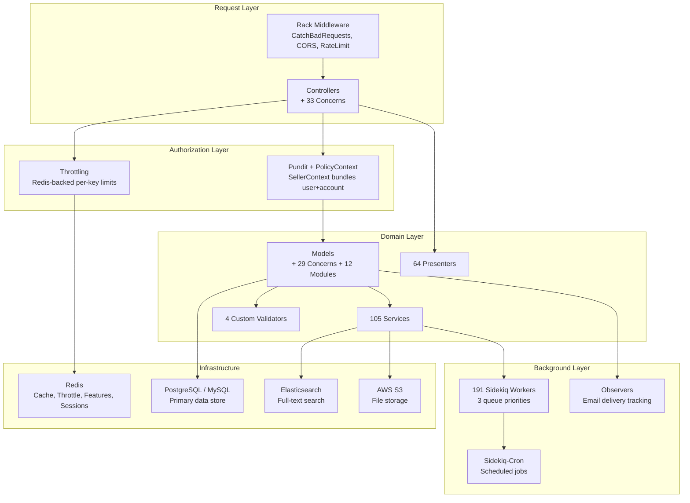

---

## Table of Contents

| # | Category | Pattern |
|---|----------|---------|
| 1-10 | Model Concerns | Soft Delete, ID Obfuscation, Stripped Fields, JSON Data, Timestamp States, Immutable Records, Secure Tokens, Unused Columns, Change Tracker, Max Purchase Count |
| 11-20 | Model Modules | Deletable, ExternalId, ObfuscateIds, Immutable, DiscountCode, MoneyFormatter, Integrations, Multipart Transfer, CDN Deletable, Mongoable |
| 21-30 | Controller Concerns | Throttling, Impersonation, Pundit Context, Events, CSRF Injection, Current Seller, Admin Tracker, Affiliate Cookies, Custom Domain, Mass Blocker |
| 31-40 | Security | Rate Limiting, CORS, Safe Redirects, CSV Safety, Log Redaction, Pwned Passwords, 2FA, Query Timeouts, Formula Injection, SSRF Prevention |
| 41-50 | Services | Email Suppression, Charge Processing, Dispute Evidence, Export Services, Webhook Delivery, Custom Domain Verification, AI Services, Analytics Compiler, Admin Search, Balance Calculation |
| 51-60 | Presenters | Dashboard, Checkout, Cart, Analytics, Product, Settings, Profile, Audience, Payout, Workflow |
| 61-70 | Background Jobs | Webhook Workers, Email Workers, Cleanup Workers, Analytics Workers, Payout Workers, Search Index Workers, Notification Workers, Cron Jobs, Retry Patterns, Queue Priorities |
| 71-80 | Infrastructure | Feature Flags, GlobalConfig, Healthchecks, Error Handling Middleware, Elasticsearch Integration, S3 File Management, Redis Patterns, Caching Strategy, Replica Lag Watcher, GeoIP |
| 81-90 | Mailers | Application Mailer, Customer Mailer, Creator Mailer, Admin Mailer, 2FA Mailer, Affiliate Mailer, Invite Mailer, Delivery Observer, SMTP Resilience, Email Routing Fallback |
| 91-100 | Validators & Utilities | Email Format, ISBN, JSON Schema, Reserved Domains, Card Type Detection, Text Scrubber, Compliance Utils, oEmbed Finder, Referrer Parser, D3 Charting Utils |

---

## Category 1: Model Concerns (1-10)

### 1. Soft Deletion (Deletable)

**What Gumroad does:** Nearly every model uses soft deletion via a `deleted_at` timestamp instead of actually removing records.

**How they implement it** (`app/modules/deletable.rb`):
- `alive` scope: `where(deleted_at: nil)`
- `deleted` scope: `where.not(deleted_at: nil)`
- `mark_deleted!` sets `deleted_at` to `Time.current` and saves
- `mark_undeleted!` clears `deleted_at` and saves
- `alive?` checks `deleted_at.nil?`
- `being_marked_as_deleted?` uses Rails dirty tracking

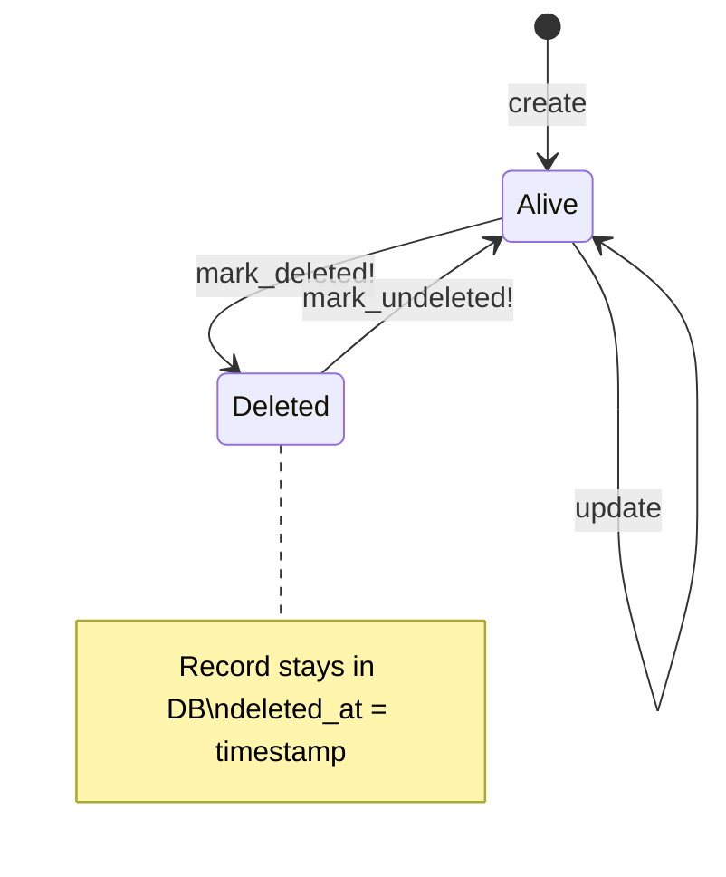

**How to implement in our starter:**

```ruby
# app/models/concerns/soft_deletable.rb
module SoftDeletable
  extend ActiveSupport::Concern

  included do
    scope :alive, -> { where(deleted_at: nil) }
    scope :deleted, -> { where.not(deleted_at: nil) }
    scope :with_deleted, -> { unscope(where: :deleted_at) }
  end

  def mark_deleted!
    update!(deleted_at: Time.current)
  end

  def mark_undeleted!
    update!(deleted_at: nil)
  end

  def alive?
    deleted_at.nil?
  end

  def deleted?
    !alive?
  end
end
```

**Migration needed:**
```ruby
add_column :accounts, :deleted_at, :datetime
add_column :memberships, :deleted_at, :datetime
add_index :accounts, :deleted_at
add_index :memberships, :deleted_at
```

---

### 2. Input Normalization (StrippedFields)

**What Gumroad does:** A `before_validation` callback strips whitespace, squeezes duplicate spaces, applies custom transforms (like downcasing emails), and converts empty strings to nil.

**How they implement it** (`app/models/concerns/stripped_fields.rb`):
- Define fields: `stripped_fields :email, transform: -> { _1.downcase }`
- Pipeline: strip → squeeze → transform → nilify_blanks
- Runs before validation so cleaned data is what gets validated

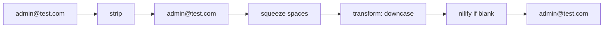

**How to implement:**

```ruby
# app/models/concerns/stripped_fields.rb
module StrippedFields
  extend ActiveSupport::Concern

  class_methods do
    def stripped_fields(*fields, transform: nil, squeeze: true, nilify: true)
      before_validation do
        fields.each do |field|
          value = send(field)
          next unless value.is_a?(String)

          value = value.strip
          value = value.squeeze(" ") if squeeze
          value = transform.call(value) if transform
          value = nil if nilify && value.blank?

          send(:"#{field}=", value)
        end
      end
    end
  end
end
```

**Usage in models:**
```ruby
class User < ApplicationRecord
  include StrippedFields
  stripped_fields :email, transform: ->(v) { v.downcase }
  stripped_fields :first_name, :last_name
end

class Account < ApplicationRecord
  include StrippedFields
  stripped_fields :name, :subdomain, :billing_email
  stripped_fields :subdomain, transform: ->(v) { v.downcase.gsub(/[^a-z0-9-]/, "") }
end
```

---

### 3. JSON Data Accessors

**What Gumroad does:** Stores flexible key-value data in a single `json_data` JSONB column, with typed getter/setter macros that act like regular attributes.

**How they implement it** (`app/models/concerns/json_data.rb`):
- `attr_json_data_accessor :setting_name, default: "value"` defines both reader + writer
- Reader returns the value from the hash, or the default if missing
- Writer sets the value in the hash and marks the column as dirty
- Defaults can be static values or callables (lambdas)

```mermaid
erDiagram
    ACCOUNT {
        uuid id PK
        string name
        jsonb json_data "Flexible key-value store"
    }
    note "json_data stores:
    - onboarding_completed: true
    - theme: 'dark'
    - feature_x_enabled: false
    - custom_branding: {...}
    No migration needed for new keys!"
```

**How to implement:**

```ruby
# app/models/concerns/json_data.rb
module JsonData
  extend ActiveSupport::Concern

  class_methods do
    def attr_json_data_accessor(name, default: nil)
      attr_json_data_reader(name, default: default)
      attr_json_data_writer(name)
    end

    def attr_json_data_reader(name, default: nil)
      define_method(name) do
        json_data_hash = self.json_data || {}
        value = json_data_hash[name.to_s]
        if value.nil? || (value.is_a?(String) && value.blank?)
          default.respond_to?(:call) ? default.call : default
        else
          value
        end
      end
    end

    def attr_json_data_writer(name)
      define_method(:"#{name}=") do |value|
        self.json_data ||= {}
        self.json_data[name.to_s] = value
        json_data_will_change! if respond_to?(:json_data_will_change!)
      end
    end
  end
end
```

**Usage:**
```ruby
class Account < ApplicationRecord
  include JsonData

  attr_json_data_accessor :onboarding_completed, default: false
  attr_json_data_accessor :theme, default: "light"
  attr_json_data_accessor :custom_branding, default: -> { {} }
end

# Works like regular attributes:
account.theme                    # => "light" (default)
account.theme = "dark"
account.save!
account.theme                    # => "dark"
```

---

### 4. Timestamp State Machine

**What Gumroad does:** Instead of string/integer enums for state, uses timestamp columns. Each state is a `_at` column — you can see WHEN each transition happened, not just the current state.

**How they implement it** (`app/models/concerns/timestamp_state_fields.rb`):
- `timestamp_state_fields :subscribed, :verified, default: :created`
- Auto-generates: `subscribed?`, `verified?`, `update_as_subscribed!`, `update_as_verified!`
- Auto-generates scopes: `User.subscribed`, `User.not_subscribed`
- The `state` method checks fields in reverse order (last declared = highest priority)

```mermaid
stateDiagram-v2
    [*] --> created: User.create!
    created --> subscribed: update_as_subscribed!
    subscribed --> verified: update_as_verified!

    note right of created: subscribed_at: nil\nverified_at: nil
    note right of subscribed: subscribed_at: 2026-03-14\nverified_at: nil
    note right of verified: subscribed_at: 2026-03-14\nverified_at: 2026-03-15
```

**How to implement:**

```ruby
# app/models/concerns/timestamp_state_fields.rb
module TimestampStateFields
  extend ActiveSupport::Concern

  class_methods do
    def timestamp_state_fields(*fields, default: :created)
      define_method(:state) do
        fields.reverse_each do |field|
          return field.to_s if send(:"#{field}_at").present?
        end
        default.to_s
      end

      fields.each do |field|
        # Predicate: user.verified?
        define_method(:"#{field}?") { send(:"#{field}_at").present? }

        # Transition: user.update_as_verified!
        define_method(:"update_as_#{field}!") do
          update!(:"#{field}_at" => Time.current)
        end

        # Scope: User.verified / User.not_verified
        scope field, -> { where.not(:"#{field}_at" => nil) }
        scope :"not_#{field}", -> { where(:"#{field}_at" => nil) }
      end
    end
  end
end
```

**Usage:**
```ruby
class User < ApplicationRecord
  include TimestampStateFields
  timestamp_state_fields :email_confirmed, :onboarded, default: :pending
end

# Migration:
# add_column :users, :email_confirmed_at, :datetime
# add_column :users, :onboarded_at, :datetime

user.state                    # => "pending"
user.update_as_email_confirmed!
user.state                    # => "email_confirmed"
user.email_confirmed?         # => true
User.email_confirmed.count    # => 1
```

---

### 5. Immutable Records

**What Gumroad does:** Financial records (invoices, charges) cannot be updated after creation. To "change" one, you soft-delete the original and create a new copy.

**How they implement it** (`app/modules/immutable.rb`):
- `before_update` raises `RecordImmutable` if non-mutable attributes changed
- `attr_mutable :deleted_at, :updated_at` whitelists fields that CAN change
- `dup_and_save` creates a new record from a copy, marks original as deleted, in a transaction

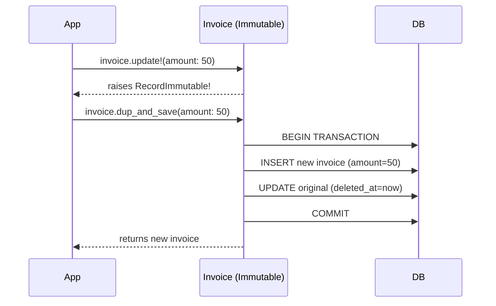

**How to implement:**

```ruby
# app/models/concerns/immutable.rb
module Immutable
  extend ActiveSupport::Concern
  include SoftDeletable

  class RecordImmutable < StandardError; end

  ALWAYS_MUTABLE = %w[deleted_at updated_at].freeze

  included do
    class_attribute :mutable_attributes, default: ALWAYS_MUTABLE.dup

    before_update :enforce_immutability!
  end

  class_methods do
    def attr_mutable(*attrs)
      self.mutable_attributes = mutable_attributes | attrs.map(&:to_s)
    end
  end

  def dup_and_save(**attrs)
    transaction do
      new_record = dup
      attrs.each { |k, v| new_record.send(:"#{k}=", v) }
      new_record.save!
      mark_deleted!
      new_record
    end
  end

  private

  def enforce_immutability!
    changed_immutable = changed - mutable_attributes
    if changed_immutable.any?
      raise RecordImmutable, "Cannot modify #{changed_immutable.join(', ')} on #{self.class.name}"
    end
  end
end
```

---

### 6. Secure External Tokens

**What Gumroad does:** Generates encrypted, scoped, expiring, URL-safe tokens for any model. Used for password resets, email verification, shareable links.

**How they implement it** (`app/models/concerns/secure_external_id.rb`):
- Token contains: model name + ID + scope + expiration
- Encrypted with AES-256-GCM via `MessageEncryptor`
- Supports key rotation (version number in token wrapper)
- Decryption validates model name, scope, and expiration

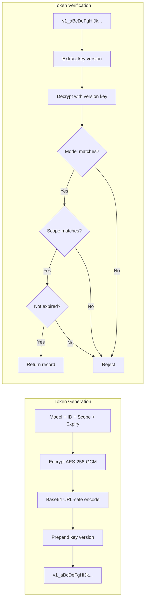

**How to implement:**

```ruby
# app/models/concerns/secure_token.rb
module SecureToken
  extend ActiveSupport::Concern

  class InvalidToken < StandardError; end
  class ExpiredToken < StandardError; end

  KEY = Rails.application.credentials.secret_key_base[0..31]
  ENCRYPTOR = ActiveSupport::MessageEncryptor.new(KEY)

  def generate_token(scope:, expires_in: 24.hours)
    payload = {
      model: self.class.name,
      id: id,
      scope: scope.to_s,
      exp: (Time.current + expires_in).to_i
    }
    ENCRYPTOR.encrypt_and_sign(payload.to_json, purpose: :secure_token)
  end

  class_methods do
    def find_by_token!(token, scope:)
      raw = ENCRYPTOR.decrypt_and_verify(token, purpose: :secure_token)
      payload = JSON.parse(raw)

      raise InvalidToken, "Model mismatch" unless payload["model"] == name
      raise InvalidToken, "Scope mismatch" unless payload["scope"] == scope.to_s
      raise ExpiredToken, "Token expired" if Time.at(payload["exp"]) < Time.current

      find(payload["id"])
    rescue ActiveSupport::MessageEncryptor::InvalidMessage
      raise InvalidToken, "Invalid token"
    end
  end
end
```

**Usage:**
```ruby
class User < ApplicationRecord
  include SecureToken
end

# Generate
token = user.generate_token(scope: :password_reset, expires_in: 1.hour)
# => "aGVsbG8gd29ybGQ..."

# Verify
user = User.find_by_token!(token, scope: :password_reset)
# => #<User id: "abc-123">

# Wrong scope
User.find_by_token!(token, scope: :email_verify)
# => raises SecureToken::InvalidToken
```

---

### 7. Unused Column Guards

**What Gumroad does:** Before removing a column from a large table (which can take hours), they first make the column "unused" — any code that tries to read/write it gets an immediate error.

**How they implement it** (`app/models/concerns/unused_columns.rb`):
- `unused_columns :old_field_name` overrides getter and setter to raise `NoMethodError`
- Deploy this first, wait for errors, fix any remaining code
- Then deploy the migration to actually drop the column

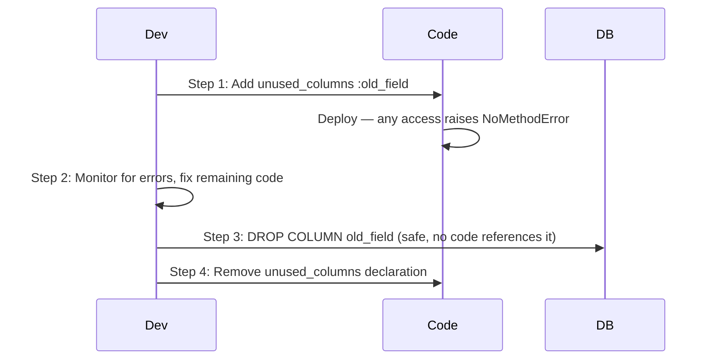

**How to implement:**

```ruby
# app/models/concerns/unused_columns.rb
module UnusedColumns
  extend ActiveSupport::Concern

  class_methods do
    def unused_columns(*columns)
      columns.each do |col|
        define_method(col) do
          raise NoMethodError, "#{col} is deprecated on #{self.class.name} and scheduled for removal"
        end

        define_method(:"#{col}=") do |_value|
          raise NoMethodError, "#{col} is deprecated on #{self.class.name} and scheduled for removal"
        end
      end
    end
  end
end
```

---

### 8. Transactional Change Tracker

**What Gumroad does:** Tracks ALL attribute changes across an entire transaction, not just the last `save`. In `after_commit`, you see everything that changed.

**Problem it solves:**
```ruby
# Without tracker:
user.update!(name: "New")   # previous_changes = {"name" => ["Old", "New"]}
user.update!(email: "new@") # previous_changes = {"email" => ["old@", "new@"]}
# In after_commit: you LOST the name change

# With tracker:
# after_commit sees: name AND email both changed
```

**How to implement:**

```ruby
# app/models/concerns/transactional_change_tracker.rb
module TransactionalChangeTracker
  extend ActiveSupport::Concern

  included do
    after_save :accumulate_changes
    after_commit :finalize_changes
    after_rollback :clear_changes
  end

  def attributes_committed
    @attributes_committed || Set.new
  end

  private

  def accumulate_changes
    @attributes_changed_in_transaction ||= Set.new
    @attributes_changed_in_transaction.merge(previous_changes.keys)
  end

  def finalize_changes
    @attributes_committed = @attributes_changed_in_transaction || Set.new
    @attributes_changed_in_transaction = nil
  end

  def clear_changes
    @attributes_changed_in_transaction = nil
    @attributes_committed = nil
  end
end
```

---

### 9. Two-Factor Authentication

**What Gumroad does:** Full TOTP-based 2FA with backup codes, enforced for admin accounts.

**How they implement it** (`app/models/concerns/two_factor_authentication.rb`):
- Uses `active_model_otp` gem for TOTP
- Generates 10 single-use backup codes on enrollment
- Admin accounts are forced to enable 2FA
- Dedicated mailer for 2FA events

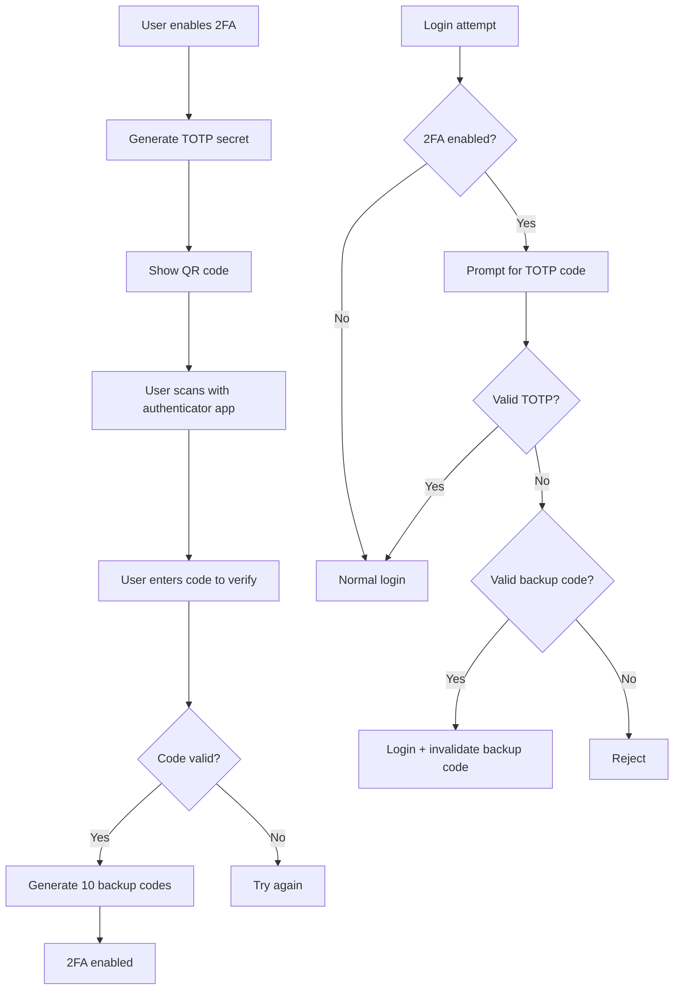

**How to implement:**

Add `devise-two-factor` or `active_model_otp` gem. Migration:
```ruby
add_column :users, :otp_secret, :string
add_column :users, :otp_required_for_login, :boolean, default: false
add_column :users, :otp_backup_codes, :text, array: true
```

---

### 10. Versionable Records

**What Gumroad does:** Some models track a version number that auto-increments on each update, enabling optimistic locking and change detection.

**How they implement it** (`app/models/concerns/versionable.rb`):
- `before_save` increments a `version` integer column
- Used for cache invalidation and conflict detection

**How to implement:**

```ruby
# app/models/concerns/versionable.rb
module Versionable
  extend ActiveSupport::Concern

  included do
    before_save :increment_version, if: :changed?
  end

  private

  def increment_version
    self.version = (version || 0) + 1
  end
end
```

---

## Category 2: Controller Concerns (11-20)

### 11. Rate Limiting (Throttling)

**What Gumroad does:** Redis-backed per-key rate limiting that any controller action can use. Returns 429 with `Retry-After` header.

**How they implement it** (`app/controllers/concerns/throttling.rb`):

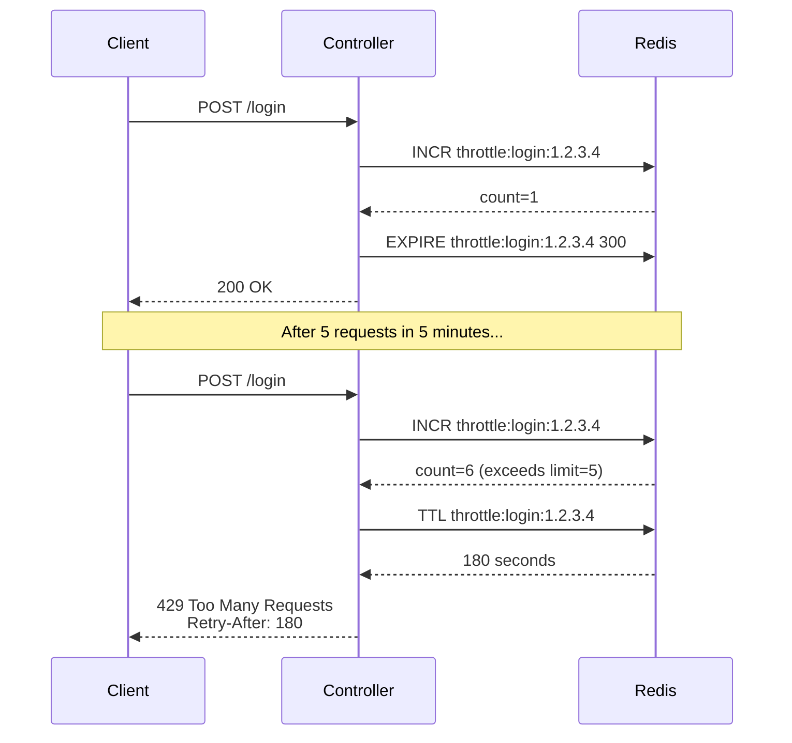

**How to implement:**

```ruby
# app/controllers/concerns/throttling.rb
module Throttling
  extend ActiveSupport::Concern

  private

  # Usage: throttle!("login:#{request.remote_ip}", limit: 5, period: 5.minutes)
  def throttle!(key, limit:, period:)
    redis = Redis.new
    cache_key = "throttle:#{key}"
    count = redis.incr(cache_key)
    redis.expire(cache_key, period.to_i) if count == 1

    if count > limit
      ttl = redis.ttl(cache_key)
      response.set_header("Retry-After", ttl.to_s)
      render json: { error: "Rate limit exceeded. Retry after #{ttl} seconds." }, status: :too_many_requests
      return false
    end

    true
  end
end
```

**Usage in a controller:**
```ruby
class SessionsController < ApplicationController
  include Throttling

  def create
    return unless throttle!("login:#{request.remote_ip}", limit: 5, period: 5.minutes)
    # ... normal login logic
  end
end
```

---

### 12. Admin Impersonation

**What Gumroad does:** Platform admins can "become" any user for debugging. State stored in Redis with 7-day TTL. Visible banner shown. Analytics skipped during impersonation.

**How they implement it** (`app/controllers/concerns/impersonate.rb`):

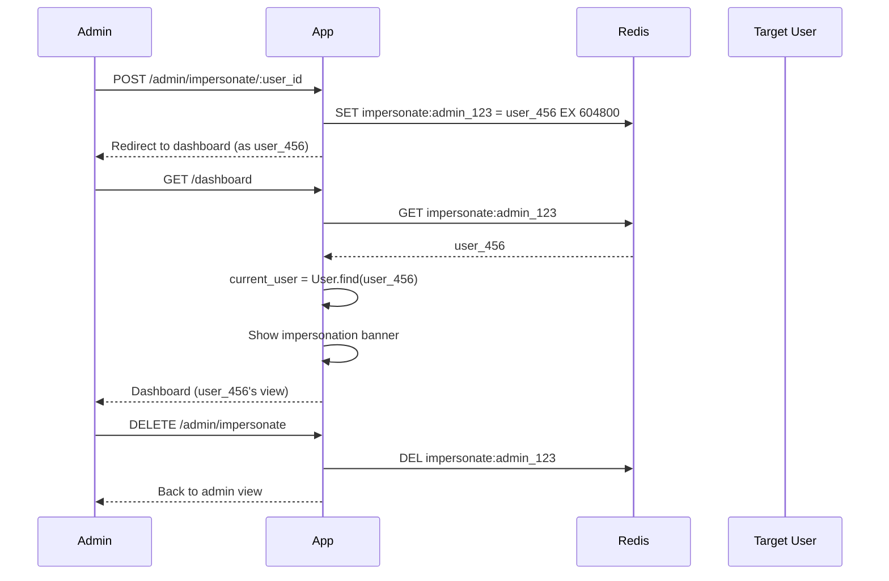

**How to implement:**

```ruby
# app/controllers/concerns/impersonatable.rb
module Impersonatable
  extend ActiveSupport::Concern

  included do
    helper_method :impersonating?, :real_current_user
  end

  def impersonate_user(user)
    return unless current_user.platform_admin?

    redis = Redis.new
    redis.set("impersonate:#{current_user.id}", user.id, ex: 7.days.to_i)
    redirect_to dashboard_path, notice: "Now impersonating #{user.name}"
  end

  def stop_impersonating
    Redis.new.del("impersonate:#{real_current_user.id}")
    redirect_to admin_users_path, notice: "Stopped impersonating"
  end

  def impersonating?
    session[:impersonating_user_id].present? ||
      Redis.new.exists?("impersonate:#{real_current_user&.id}")
  end

  def real_current_user
    @real_current_user ||= warden.user(:user)
  end

  def impersonated_user
    return unless impersonating?
    user_id = Redis.new.get("impersonate:#{real_current_user.id}")
    User.find_by(id: user_id)
  end
end
```

---

### 13. Pundit Policy Context

**What Gumroad does:** Instead of passing just `current_user` to Pundit, bundles user + account + role into a context object. Policies can check all three.

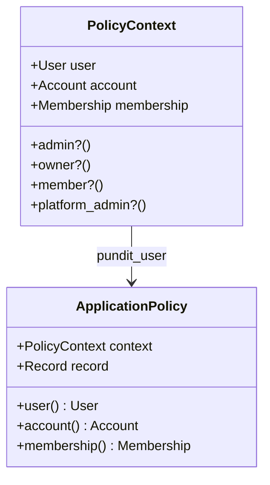

**How to implement:**

```ruby
# app/models/policy_context.rb
PolicyContext = Struct.new(:user, :account, :membership, keyword_init: true) do
  delegate :platform_admin?, to: :user, allow_nil: true

  def admin?
    membership&.admin? || membership&.owner?
  end

  def owner?
    membership&.owner?
  end

  def member?
    membership.present?
  end
end

# In ApplicationController:
def pundit_user
  PolicyContext.new(
    user: current_user,
    account: current_account,
    membership: current_membership
  )
end

# In policies:
class AccountPolicy < ApplicationPolicy
  def update?
    context.admin? || context.platform_admin?
  end

  private

  def context
    user # Pundit calls this 'user' but it's actually our PolicyContext
  end
end
```

---

### 14. Event Tracking

**What Gumroad does:** Every significant user action creates an `Event` record with browser fingerprint, IP, referrer, UTM params, and device info.

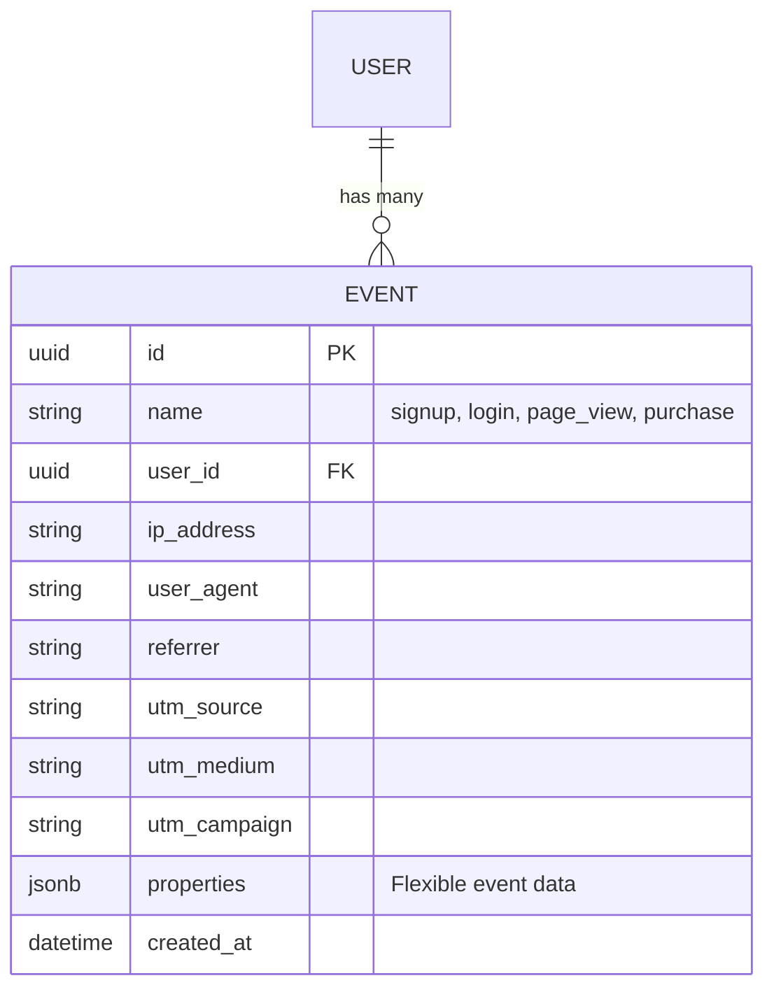

**How to implement:**

```ruby
# Migration:
create_table :events, id: :uuid do |t|
  t.string :name, null: false
  t.references :user, type: :uuid, foreign_key: true
  t.references :account, type: :uuid, foreign_key: true
  t.string :ip_address
  t.string :user_agent
  t.string :referrer
  t.string :utm_source
  t.string :utm_medium
  t.string :utm_campaign
  t.jsonb :properties, default: {}
  t.timestamps
end

add_index :events, :name
add_index :events, :created_at
```

```ruby
# app/controllers/concerns/trackable.rb
module Trackable
  extend ActiveSupport::Concern

  private

  def track_event(name, properties = {})
    Event.create!(
      name: name,
      user: current_user,
      account: current_account,
      ip_address: request.remote_ip,
      user_agent: request.user_agent,
      referrer: request.referrer,
      utm_source: params[:utm_source],
      utm_medium: params[:utm_medium],
      utm_campaign: params[:utm_campaign],
      properties: properties
    )
  rescue StandardError => e
    Rails.logger.error("Event tracking failed: #{e.message}")
  end
end
```

---

### 15. CSRF Token Injection

**What Gumroad does:** Injects the CSRF token into API responses so SPAs and Inertia.js pages can make authenticated requests without a separate token fetch.

**How to implement:**

```ruby
# app/controllers/concerns/csrf_token_injector.rb
module CsrfTokenInjector
  extend ActiveSupport::Concern

  included do
    after_action :set_csrf_cookie
  end

  private

  def set_csrf_cookie
    cookies["CSRF-TOKEN"] = {
      value: form_authenticity_token,
      httponly: false  # JS needs to read it
    }
  end
end
```

---

### 16-20: Additional Controller Concerns

| # | Pattern | Gumroad File | Purpose | Implementation |
|---|---------|-------------|---------|----------------|
| 16 | **Current Seller** | `concerns/current_seller.rb` | Resolves which account/seller context a request is for | Already have via `SetCurrentAttributes` |
| 17 | **Admin Action Tracker** | `concerns/admin_action_tracker.rb` | Counts every admin controller action for audit | Create `AdminActionLog` model, log in `Admin::BaseController` `after_action` |
| 18 | **Affiliate Cookies** | `concerns/affiliate_cookie.rb` | Stores affiliate referral in cookie for attribution | Create concern that reads `?ref=` param and stores in cookie with 30-day expiry |
| 19 | **Custom Domain Config** | `concerns/custom_domain_config.rb` | Serves tenant content on their custom domain | Already have subdomain/custom_domain on Account, needs Rack middleware for resolution |
| 20 | **Mass Blocker** | `concerns/mass_blocker.rb` | Bulk-block users/IPs from a controller action | Create concern with `block_users!(user_ids)` that sets `blocked_at` timestamp |

---

## Category 3: Security Patterns (21-30)

### 21. Rack-Attack Rate Limiting

**What Gumroad uses:** `rack-attack` gem for broad protection at the Rack layer, before Rails even processes the request.

```ruby
# config/initializers/rack_attack.rb
Rack::Attack.throttle("login/ip", limit: 5, period: 60) do |req|
  req.ip if req.path == "/users/sign_in" && req.post?
end

Rack::Attack.throttle("login/email", limit: 5, period: 60) do |req|
  if req.path == "/users/sign_in" && req.post?
    req.params.dig("user", "email")&.downcase&.strip
  end
end

Rack::Attack.throttle("api/ip", limit: 100, period: 60) do |req|
  req.ip if req.path.start_with?("/api/")
end

# Blocklist bad actors
Rack::Attack.blocklist("block bad IPs") do |req|
  Rack::Attack::Fail2Ban.filter("login-#{req.ip}", maxretry: 20, findtime: 1.minute, bantime: 1.hour) do
    req.path == "/users/sign_in" && req.post?
  end
end
```

---

### 22. Safe Redirect Service

**What Gumroad does** (`app/services/safe_redirect_path_service.rb`): Prevents open redirect attacks by validating redirect URLs.

```ruby
# app/services/safe_redirect_service.rb
class SafeRedirectService
  def initialize(url, request:, allow_subdomains: false)
    @url = url.to_s
    @request = request
    @allow_subdomains = allow_subdomains
  end

  def safe_path
    return "/" if @url.blank?

    uri = Addressable::URI.parse(@url)

    if uri.host.nil?
      # Relative path — safe
      normalize_path(uri.path, uri.query)
    elsif uri.host == @request.host
      # Same host — safe
      normalize_path(uri.path, uri.query)
    elsif @allow_subdomains && uri.host.end_with?(".#{root_domain}")
      # Subdomain — safe if allowed
      @url
    else
      # External host — redirect to root
      "/"
    end
  rescue Addressable::URI::InvalidURIError
    "/"
  end

  private

  def root_domain
    @request.host.split(".")[-2..].join(".")
  end

  def normalize_path(path, query)
    result = path.presence || "/"
    result += "?#{query}" if query.present?
    result
  end
end
```

---

### 23. Log Redaction

**What Gumroad does** (`lib/utilities/log_redactor.rb`): Recursively strips sensitive values from any hash/object before logging.

```ruby
# lib/utilities/log_redactor.rb
module LogRedactor
  SENSITIVE_KEYS = %w[
    token access_token refresh_token api_key secret
    authorization password stripe_publishable_key
    paypal-auth-assertion verify_sign
  ].freeze

  FILTERED = "[FILTERED]"

  def self.redact(data)
    case data
    when Hash
      data.each_with_object({}) do |(key, value), result|
        result[key] = sensitive_key?(key) ? FILTERED : redact(value)
      end
    when Array
      data.map { |item| redact(item) }
    else
      data
    end
  end

  def self.sensitive_key?(key)
    SENSITIVE_KEYS.any? { |pattern| key.to_s.downcase.include?(pattern) }
  end
end

# Usage:
Rails.logger.info(LogRedactor.redact(stripe_response))
```

---

### 24. CSV Formula Injection Prevention

```ruby
# lib/utilities/csv_safe.rb
class CsvSafe < CSV
  FORMULA_PREFIXES = ["=", "@", "|", "%"].freeze

  def <<(row)
    super(row.map { |field| sanitize(field) })
  end

  private

  def sanitize(field)
    return field unless field.is_a?(String)
    return field if field.blank?

    if FORMULA_PREFIXES.include?(field[0])
      "'#{field}"
    elsif ["+", "-"].include?(field[0]) && !numeric_string?(field)
      "'#{field}"
    else
      field
    end
  end

  def numeric_string?(str)
    Float(str) rescue false
  end
end
```

---

### 25. Pwned Password Checking

**What Gumroad uses:** `devise-pwned_password` gem — checks passwords against the Have I Been Pwned database during registration/password change.

```ruby
# Gemfile
gem "devise-pwned_password"

# app/models/user.rb
class User < ApplicationRecord
  devise :database_authenticatable, :registerable, :pwned_password
  # Automatically rejects passwords found in data breaches
end
```

---

### 26-30: Additional Security Patterns

| # | Pattern | Gumroad Source | Implementation |
|---|---------|---------------|----------------|
| 26 | **Query Timeout** | `lib/utilities/with_max_execution_time.rb` | `SET LOCAL statement_timeout = '5000'` in a transaction block for dangerous queries |
| 27 | **SSRF Prevention in Webhooks** | Webhook URL validation | Validate outgoing webhook URLs don't resolve to localhost/internal IPs using `Resolv.getaddresses` |
| 28 | **Content Security Policy** | `initializers/content_security_policy.rb` | Already have CSP initializer — add stricter directives for script-src, connect-src |
| 29 | **Bad Request Middleware** | `lib/catch_bad_request_errors.rb` | Rack middleware that catches `ActionController::BadRequest` and returns clean 400 |
| 30 | **Devise Pwned Password** | `Gemfile` | Add `devise-pwned_password` gem to reject breached passwords |

---

## Category 4: Services Pattern (31-40)

### 31. Service Object Convention

**What Gumroad does:** 105 service objects in `app/services/` with a consistent pattern:

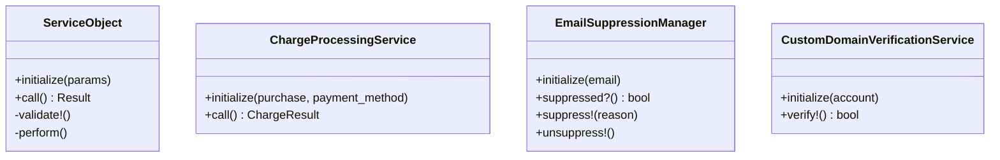

**How to implement in our starter:**

```ruby
# app/services/application_service.rb
class ApplicationService
  def self.call(...)
    new(...).call
  end

  def call
    raise NotImplementedError
  end
end

# Example: app/services/create_team_account_service.rb
class CreateTeamAccountService < ApplicationService
  def initialize(user:, name:, subdomain: nil)
    @user = user
    @name = name
    @subdomain = subdomain
  end

  def call
    ActiveRecord::Base.transaction do
      account = @user.owned_accounts.create!(
        name: @name,
        subdomain: @subdomain,
        personal: false
      )
      account.memberships.create!(
        user: @user,
        role: :owner,
        status: :active
      )
      account
    end
  end
end

# Usage:
account = CreateTeamAccountService.call(user: current_user, name: "Acme Corp")
```

---

### 32-40: Key Service Patterns from Gumroad

| # | Service | Gumroad File | What It Does | Our Implementation |
|---|---------|-------------|--------------|-------------------|
| 32 | **Email Suppression** | `email_suppression_manager.rb` | Manages bounce/spam lists, prevents sending to bad addresses | Create `EmailSuppression` model + service |
| 33 | **Charge Processing** | `services/charge/` directory | Multi-step payment with retry, fraud check, receipt | Create `ProcessPaymentService` when adding Stripe |
| 34 | **Dispute Evidence** | `services/dispute_evidence/` | Auto-compiles Stripe dispute evidence from order data | Create when adding Stripe dispute handling |
| 35 | **Export Service** | `services/exports/` | Background CSV/JSON export with S3 upload + email notification | Create `ExportService` base class + `ExportJob` |
| 36 | **Webhook Delivery** | `post_to_ping_endpoints_worker.rb` | HMAC-signed webhook with retry + delivery tracking | See pattern #26 in outgoing webhooks |
| 37 | **Domain Verification** | `custom_domain_verification_service.rb` | DNS CNAME/TXT record verification for custom domains | Create when adding custom domain feature |
| 38 | **Admin Search** | `admin_search_service.rb` | Unified search across users, accounts, transactions | Create `AdminSearchService` using PostgreSQL full-text search |
| 39 | **Analytics Compiler** | `gumroad_daily_analytics_compiler.rb` | Aggregates daily metrics into summary records | Create `DailyAnalyticsJob` + `DailyMetric` model |
| 40 | **Balance Calculation** | `services/balance/` | Computes available balance considering holds, refunds, fees | Create when adding payout/billing |

---

## Category 5: Presenter Layer (41-50)

### 41. Presenter Pattern

**What Gumroad does:** 64 presenters in `app/presenters/` that assemble structured data for views. Each presenter accepts domain objects and returns a hash.

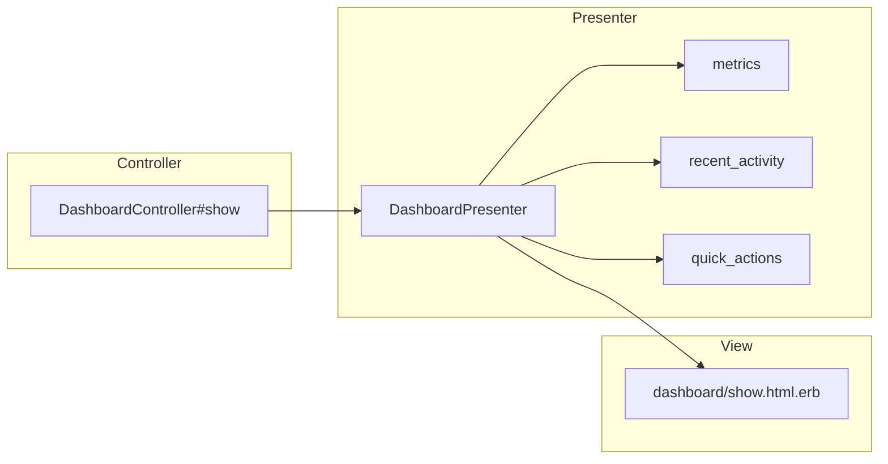

**How to implement:**

```ruby
# app/presenters/base_presenter.rb
class BasePresenter
  def initialize(user:, account:)
    @user = user
    @account = account
  end

  def to_h
    raise NotImplementedError
  end
end

# app/presenters/dashboard_presenter.rb
class DashboardPresenter < BasePresenter
  def to_h
    {
      metrics: metrics,
      recent_activity: recent_activity,
      quick_actions: quick_actions
    }
  end

  private

  def metrics
    {
      total_members: @account.memberships.active.count,
      account_type: @account.personal? ? "Personal" : "Team",
      created_at: @account.created_at
    }
  end

  def recent_activity
    # Assemble activity data
    []
  end

  def quick_actions
    [
      { title: "Invite Members", path: "/dashboard/members" },
      { title: "Settings", path: "/dashboard/settings/general" }
    ]
  end
end

# In controller:
def show
  @presenter = DashboardPresenter.new(user: current_user, account: current_account)
end

# In view:
<% @presenter.to_h[:metrics].each do |key, value| %>
  ...
<% end %>
```

---

### 42-50: Key Presenters

| # | Presenter | Purpose |
|---|-----------|---------|
| 42 | **AnalyticsPresenter** | Assembles chart data, date ranges, comparisons |
| 43 | **CheckoutPresenter** | Bundles product, pricing, discount, payment method data |
| 44 | **SettingsPresenter** | Groups all settings sections with current values |
| 45 | **ProfilePresenter** | User profile data + stats for public display |
| 46 | **MembersPresenter** | Member list with roles, invitation status, permissions |
| 47 | **BillingPresenter** | Current plan, payment method, invoices, usage |
| 48 | **NotificationsPresenter** | Notification preferences, recent notifications |
| 49 | **AdminDashboardPresenter** | Platform metrics, system health, recent events |
| 50 | **ExportPresenter** | Available export types, recent exports, status |

---

## Category 6: Background Jobs (51-60)

### 51. Queue Priority Architecture

**What Gumroad does:** 191 workers with 3 queue priorities:

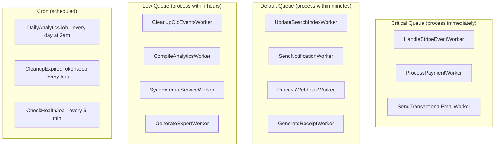

**How to implement:**

```yaml
# config/sidekiq.yml
:concurrency: 5
:queues:
  - [critical, 6]
  - [default, 3]
  - [low, 1]
```

```ruby
# Example workers:

# app/jobs/deliver_webhook_job.rb
class DeliverWebhookJob < ApplicationJob
  queue_as :default
  retry_on StandardError, wait: :polynomially_longer, attempts: 5

  def perform(webhook_id, payload)
    webhook = Webhook.find(webhook_id)
    # Sign and deliver
  end
end

# app/jobs/cleanup_old_events_job.rb
class CleanupOldEventsJob < ApplicationJob
  queue_as :low

  def perform
    Event.where("created_at < ?", 90.days.ago)
         .where(user_id: nil)
         .in_batches
         .delete_all
  end
end
```

---

### 52-60: Key Background Jobs

| # | Job | Queue | Schedule | Purpose |
|---|-----|-------|----------|---------|
| 52 | **HandleStripeEventJob** | critical | on webhook | Process Stripe webhook events |
| 53 | **SendEmailJob** | critical | immediate | Deliver transactional emails |
| 54 | **ProcessWebhookDeliveryJob** | default | immediate | Deliver outgoing webhooks with retry |
| 55 | **UpdateSearchIndexJob** | default | immediate | Reindex model in search after change |
| 56 | **GenerateExportJob** | low | on request | Build CSV/JSON export, upload to S3 |
| 57 | **DailyAnalyticsJob** | low | cron 2am | Compile daily metrics summary |
| 58 | **CleanupExpiredSessionsJob** | low | cron hourly | Remove expired sessions from Redis |
| 59 | **CheckExternalServicesJob** | default | cron 5min | Verify Stripe, Redis, Sidekiq health |
| 60 | **PurgeOldVersionsJob** | low | cron weekly | Clean up PaperTrail versions older than 1 year |

---

## Category 7: Infrastructure (61-70)

### 61. Feature Flags (Flipper)

**What Gumroad does:** Flipper with Redis adapter. Gated per-user, per-account, or percentage-based rollouts.

```ruby
# Gemfile
gem "flipper"
gem "flipper-redis"
gem "flipper-ui"

# config/initializers/flipper.rb
Flipper.configure do |config|
  config.adapter { Flipper::Adapters::Redis.new(Redis.new) }
end

# app/models/user.rb
class User < ApplicationRecord
  include Flipper::Identifier  # Enables per-user flags
end

# config/routes.rb
authenticate :user, ->(u) { u.platform_admin? } do
  mount Flipper::UI.app(Flipper) => "/admin/flipper"
end

# Usage in controllers/views:
if Flipper.enabled?(:new_billing_page, current_user)
  render "billing/new_design"
else
  render "billing/show"
end
```

---

### 62. GlobalConfig

```ruby
# lib/utilities/global_config.rb
module GlobalConfig
  SENTINEL = Object.new.freeze

  def self.get(name, default = SENTINEL)
    value = ENV[name.to_s]
    return value if value.present?

    credential_key = name.to_s.downcase.to_sym
    value = Rails.application.credentials.dig(credential_key)
    return value if value.present?

    raise KeyError, "Missing config: #{name}" if default == SENTINEL
    default
  end

  def self.dig(*parts, default: SENTINEL)
    env_key = parts.join("__").upcase
    value = ENV[env_key]
    return value if value.present?

    credential_keys = parts.map { |p| p.to_s.downcase.to_sym }
    value = Rails.application.credentials.dig(*credential_keys)
    return value if value.present?

    raise KeyError, "Missing config: #{env_key}" if default == SENTINEL
    default
  end
end

# Usage:
GlobalConfig.get("STRIPE_SECRET_KEY")
GlobalConfig.dig(:stripe, :secret_key, default: nil)
```

---

### 63. Enhanced Healthchecks

```ruby
# app/controllers/healthcheck_controller.rb
class HealthcheckController < ActionController::API
  SIDEKIQ_QUEUE_LIMITS = {
    "critical" => 12_000,
    "default" => 300_000,
    "low" => 500_000
  }.freeze

  def index
    render plain: "ok"
  end

  def detailed
    checks = {
      database: check_database,
      redis: check_redis,
      sidekiq: check_sidekiq
    }

    status = checks.values.all? { |c| c[:status] == "ok" } ? :ok : :service_unavailable
    render json: checks, status: status
  end

  private

  def check_database
    ActiveRecord::Base.connection.execute("SELECT 1")
    { status: "ok" }
  rescue => e
    { status: "error", message: e.message }
  end

  def check_redis
    Redis.new.ping
    { status: "ok" }
  rescue => e
    { status: "error", message: e.message }
  end

  def check_sidekiq
    queues = Sidekiq::Queue.all.map do |q|
      limit = SIDEKIQ_QUEUE_LIMITS[q.name] || 100_000
      { name: q.name, size: q.size, limit: limit, ok: q.size < limit }
    end

    status = queues.all? { |q| q[:ok] } ? "ok" : "overloaded"
    { status: status, queues: queues }
  rescue => e
    { status: "error", message: e.message }
  end
end
```

---

### 64-70: Additional Infrastructure

| # | Pattern | Purpose | Implementation |
|---|---------|---------|----------------|
| 64 | **Bad Request Middleware** | Clean 400 for malformed requests | Rack middleware that catches `ActionController::BadRequest` |
| 65 | **Elasticsearch Integration** | Full-text search | `searchkick` or `elasticsearch-model` gem + search concern |
| 66 | **S3 Direct Upload** | Client-side file uploads | Active Storage direct upload with presigned URLs |
| 67 | **Redis Caching Patterns** | Cache expensive queries | `Rails.cache.fetch` with Redis adapter + cache keys per account |
| 68 | **Replica Lag Watcher** | Route reads to replica safely | Check replication lag before reading from replica |
| 69 | **GeoIP Lookup** | IP-to-country resolution | `maxmind-geoip2` gem for fraud detection + analytics |
| 70 | **Sidekiq-Cron Setup** | Scheduled recurring jobs | `sidekiq-cron` gem with YAML-based schedule |

---

## Category 8: Mailers (71-80)

### 71. ApplicationMailer with Error Handling

**What Gumroad does:** Rescues SMTP errors, validates from-email domains, adds tracking headers.

```ruby
# app/mailers/application_mailer.rb
class ApplicationMailer < ActionMailer::Base
  default from: -> { "Starter <noreply@#{default_domain}>" }
  layout "mailer"

  rescue_from Net::SMTPAuthenticationError, with: :handle_smtp_error
  rescue_from Net::SMTPSyntaxError, with: :handle_smtp_error

  private

  def default_domain
    GlobalConfig.get("MAILER_DOMAIN", "starter.app")
  end

  def handle_smtp_error(exception)
    Rails.logger.error("Mailer SMTP Error: #{exception.class} - #{exception.message}")
    # Don't re-raise — prevents 500 errors from email failures
  end

  def add_tracking_headers(mailer_class, mailer_action)
    headers["X-Mailer-Class"] = mailer_class
    headers["X-Mailer-Action"] = mailer_action
    headers["X-Sent-At"] = Time.current.iso8601
  end
end
```

---

### 72-80: Key Mailers

| # | Mailer | Emails Sent |
|---|--------|-------------|
| 72 | **CustomerMailer** | Welcome, purchase receipt, download link, subscription renewal |
| 73 | **CreatorMailer** | New sale notification, payout confirmation, dispute alert |
| 74 | **AdminMailer** | System alerts, daily digest, security notifications |
| 75 | **InviteMailer** | Team invitation, account invitation acceptance |
| 76 | **TwoFactorMailer** | 2FA enabled/disabled confirmation, backup codes |
| 77 | **AffiliateMailer** | Affiliate signup confirmation, commission earned |
| 78 | **ServiceMailer** | Password reset, email change, account deletion |
| 79 | **TeamMailer** | Member added, role changed, member removed |
| 80 | **EmailDeliveryObserver** | Tracks all sent emails for delivery monitoring |

---

## Category 9: Custom Validators (81-90)

### 81. Email Format Validator

```ruby
# app/validators/email_format_validator.rb
class EmailFormatValidator < ActiveModel::EachValidator
  EMAIL_REGEX = /\A[^@\s]+@[^@\s]+\.[^@\s]+\z/

  def validate_each(record, attribute, value)
    return if value.blank?
    unless self.class.valid?(value)
      record.errors.add(attribute, options[:message] || "is not a valid email address")
    end
  end

  def self.valid?(email)
    return false if email.blank?
    return false unless email.match?(EMAIL_REGEX)
    return false if email.length > 254
    return false if email.split("@").first.length > 64

    domain = email.split("@").last
    return false if domain.start_with?(".") || domain.end_with?(".")
    true
  end
end

# Usage:
class User < ApplicationRecord
  validates :email, email_format: true
end
```

---

### 82. Subdomain Validator

```ruby
# app/validators/subdomain_validator.rb
class SubdomainValidator < ActiveModel::EachValidator
  RESERVED = %w[www app api admin mail ftp cdn assets static blog docs help support].freeze
  FORMAT = /\A[a-z0-9]([a-z0-9-]*[a-z0-9])?\z/

  def validate_each(record, attribute, value)
    return if value.blank?

    unless value.match?(FORMAT)
      record.errors.add(attribute, "must be lowercase alphanumeric and hyphens only")
      return
    end

    if value.length < 3
      record.errors.add(attribute, "must be at least 3 characters")
    elsif value.length > 63
      record.errors.add(attribute, "must be 63 characters or fewer")
    end

    if RESERVED.include?(value)
      record.errors.add(attribute, "is reserved")
    end
  end
end
```

---

### 83. JSON Schema Validator

```ruby
# app/validators/json_validator.rb
class JsonValidator < ActiveModel::EachValidator
  def validate_each(record, attribute, value)
    return if value.blank?

    begin
      JSON.parse(value) if value.is_a?(String)
    rescue JSON::ParserError
      record.errors.add(attribute, "must be valid JSON")
    end
  end
end
```

---

### 84-90: Additional Validators & Utilities

| # | Utility | Gumroad Source | Purpose | Implementation |
|---|---------|---------------|---------|----------------|
| 84 | **Reserved Email Domains** | `not_reserved_email_domain_validator.rb` | Block disposable email domains | Maintain list of disposable domains, validate on signup |
| 85 | **Card Type Detection** | `lib/utilities/card_type.rb` | Detect Visa/MC/Amex from card number prefix | BIN range lookup utility |
| 86 | **Text Scrubber** | `lib/utilities/text_scrubber.rb` | Strip HTML, normalize unicode, remove control chars | Sanitize user input before storage |
| 87 | **Compliance Utils** | `lib/utilities/compliance.rb` | Tax ID validation (VAT, GST, ABN) | Country-specific tax ID format validation |
| 88 | **oEmbed Finder** | `lib/utilities/o_embed_finder.rb` | Convert URLs to embed HTML (YouTube, Vimeo) | URL-to-embed resolution service |
| 89 | **Referrer Parser** | `lib/utilities/referrer.rb` | Parse referrer URLs into source categories | Classify referrer as social/search/direct/email |
| 90 | **ISBN Validator** | `isbn_validator.rb` | Validate ISBN-10 and ISBN-13 format | Checksum validation for product ISBNs |

---

## Category 10: Outgoing Webhooks & Integrations (91-100)

### 91. Outgoing Webhook System

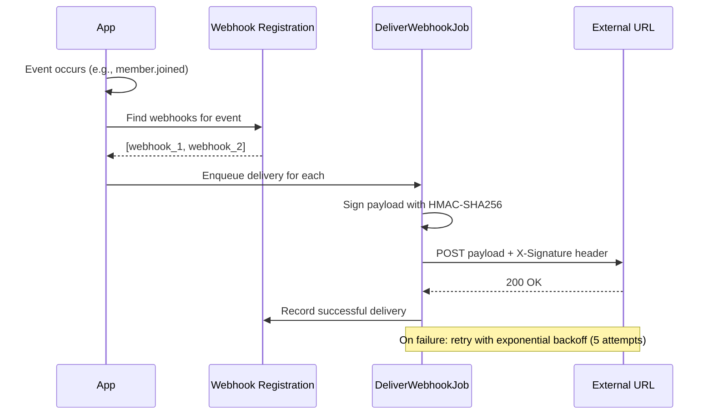

**Models needed:**

```ruby
# Migration:
create_table :webhooks, id: :uuid do |t|
  t.references :account, type: :uuid, foreign_key: true, null: false
  t.string :url, null: false
  t.string :secret, null: false  # For HMAC signing
  t.string :events, array: true, default: []  # ["member.joined", "account.updated"]
  t.boolean :enabled, default: true
  t.timestamps
end

create_table :webhook_deliveries, id: :uuid do |t|
  t.references :webhook, type: :uuid, foreign_key: true, null: false
  t.string :event, null: false
  t.string :status  # pending, success, failed
  t.integer :response_code
  t.text :response_body
  t.integer :attempt, default: 0
  t.datetime :delivered_at
  t.timestamps
end
```

```ruby
# app/jobs/deliver_webhook_job.rb
class DeliverWebhookJob < ApplicationJob
  queue_as :default
  retry_on StandardError, wait: :polynomially_longer, attempts: 5

  def perform(webhook_id, event, payload)
    webhook = Webhook.find(webhook_id)
    return unless webhook.enabled?

    delivery = webhook.deliveries.create!(event: event, status: "pending")

    signature = OpenSSL::HMAC.hexdigest("SHA256", webhook.secret, payload.to_json)

    response = HTTP.timeout(10).headers(
      "Content-Type" => "application/json",
      "X-Webhook-Signature" => "sha256=#{signature}",
      "X-Webhook-Event" => event
    ).post(webhook.url, json: payload)

    delivery.update!(
      status: response.status.success? ? "success" : "failed",
      response_code: response.code,
      response_body: response.body.to_s.truncate(1000),
      delivered_at: Time.current,
      attempt: delivery.attempt + 1
    )
  end
end
```

---

### 92. Integration Service Pattern

**What Gumroad does:** Dedicated API service classes for each external integration.

```ruby
# app/services/integrations/discord_service.rb
class Integrations::DiscordService
  def initialize(account)
    @account = account
    @webhook_url = account.json_data["discord_webhook_url"]
  end

  def notify(message:, embed: nil)
    return unless @webhook_url.present?

    payload = { content: message }
    payload[:embeds] = [embed] if embed

    HTTP.post(@webhook_url, json: payload)
  rescue HTTP::Error => e
    Rails.logger.error("Discord notification failed: #{e.message}")
  end
end
```

---

### 93-100: Final Patterns

| # | Pattern | Gumroad Source | Purpose | Priority |
|---|---------|---------------|---------|----------|
| 93 | **OAuth Provider (Doorkeeper)** | `gem "doorkeeper"` | OAuth2 provider for API access tokens | Medium |
| 94 | **Friendly URLs** | `gem "friendly_id"` | Slug-based URLs instead of UUIDs | Low |
| 95 | **Ancestry/Tree** | `gem "ancestry"` | Hierarchical data (nested categories, comments) | Low |
| 96 | **Inertia.js Integration** | `gem "inertia_rails"` | Server-side Rails + React/Vue frontend | Medium |
| 97 | **Elasticsearch Search** | `gem "elasticsearch-model"` | Full-text search with facets and filtering | Medium |
| 98 | **Action Caching** | `gem "actionpack-action_caching"` | Cache entire controller actions | Low |
| 99 | **Bugsnag/Error Tracking** | `gem "bugsnag"` | Production error monitoring with context | High |
| 100 | **Countries/Compliance** | `gem "countries"` | Country data for tax, shipping, compliance | Medium |

---

## Implementation Priority Matrix

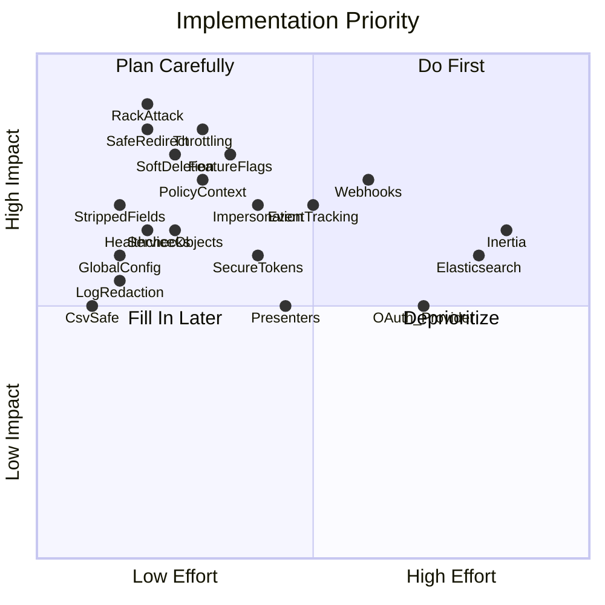

---

## Quick Start — First 10 to Implement

1. **StrippedFields** concern (30 min) — prevents dirty data from day 1
2. **rack-attack** initializer (30 min) — prevents brute force immediately
3. **SoftDeletable** concern (30 min) — never lose data
4. **GlobalConfig** utility (20 min) — clean config access
5. **SafeRedirectService** (20 min) — prevent open redirects
6. **LogRedactor** utility (15 min) — prevent secret leaks in logs
7. **CsvSafe** utility (10 min) — ready for when exports ship
8. **Healthcheck controller** (30 min) — production monitoring
9. **Throttling** concern (20 min) — per-action rate limits
10. **EmailFormatValidator** (15 min) — proper email validation

**Total: ~4 hours for a significantly more production-ready starter.**
