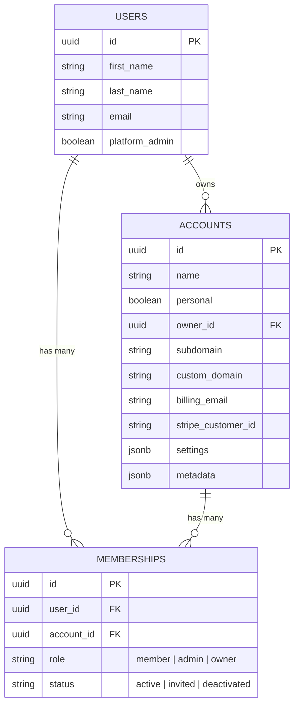
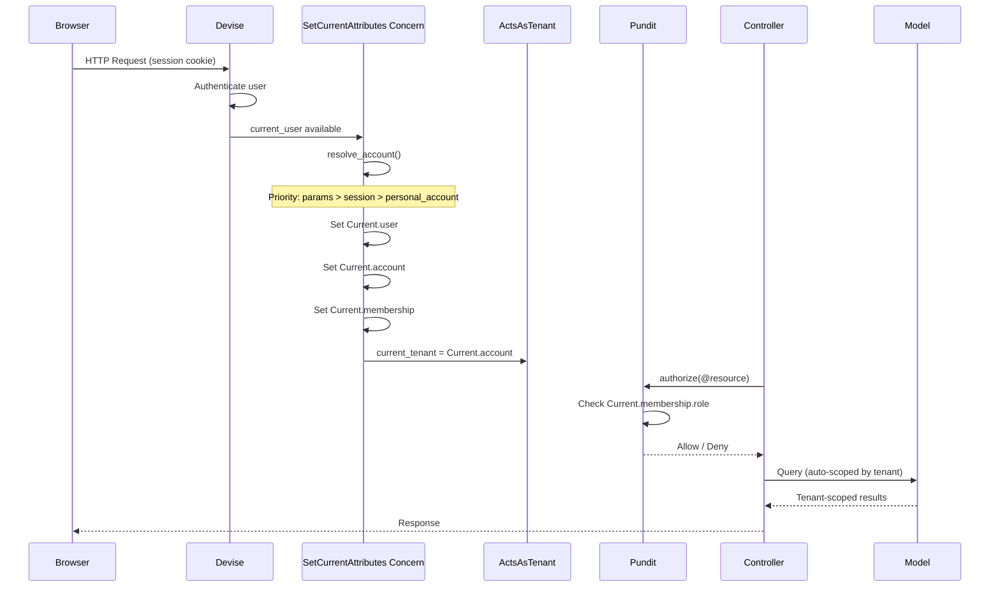
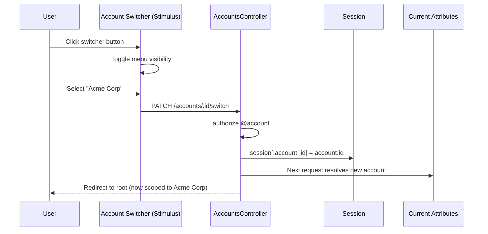
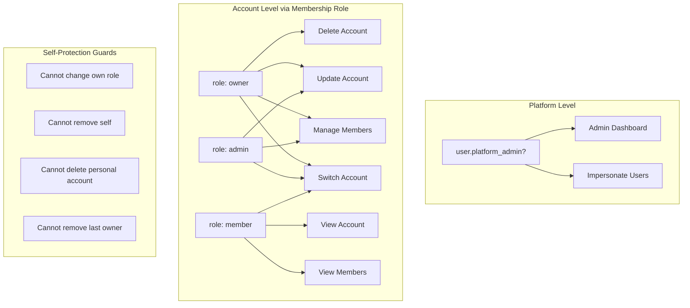
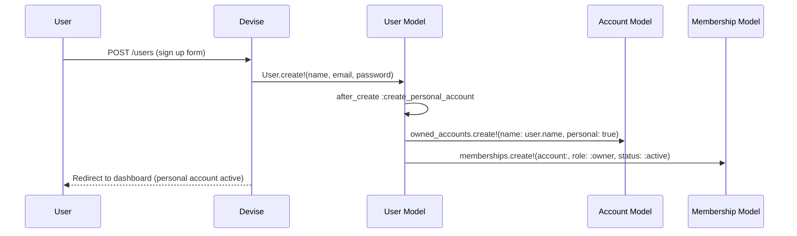
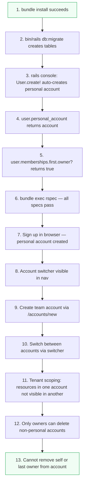
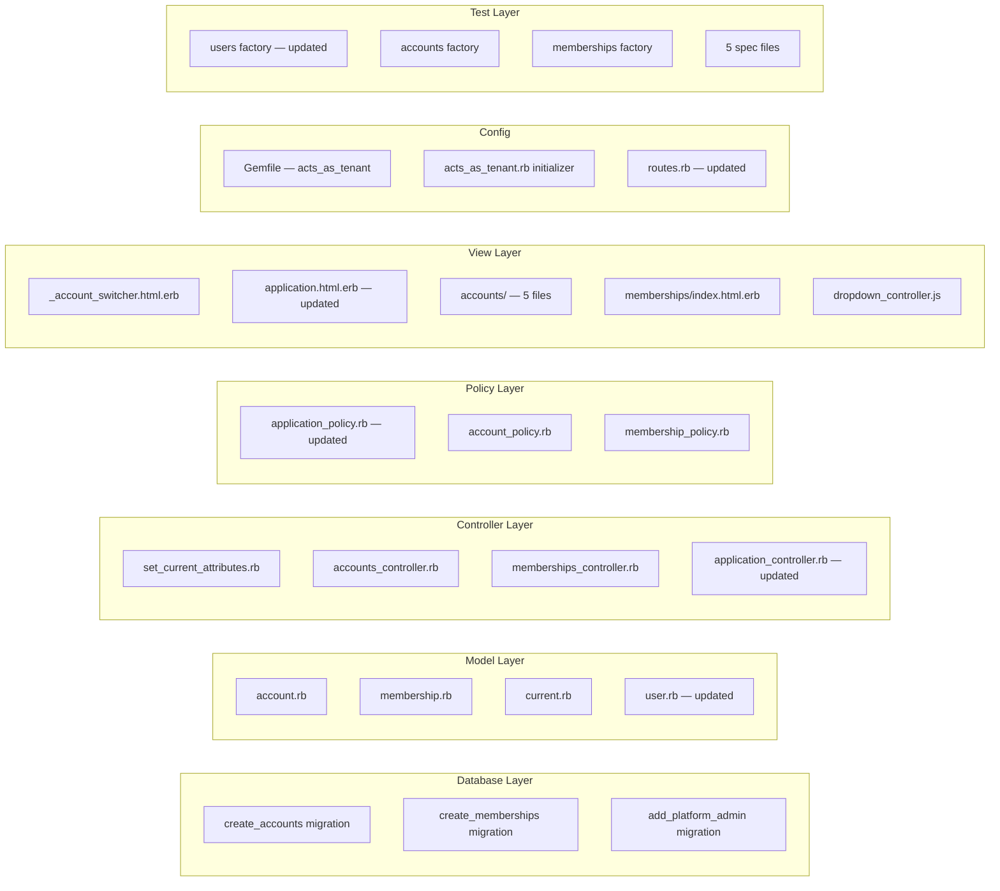

# Phase 1: Multi-Tenancy Implementation Guide

> **Goal**: Add Account + Membership models, tenant scoping via `acts_as_tenant`, account switching UI, and Pundit authorization — enabling B2C and basic B2B support.

---

## Architecture Overview



## Request Lifecycle

Every authenticated request flows through this pipeline:



## Account Switching Flow



## Authorization Model



## User Signup Flow



---

## Step-by-Step Implementation

### Step 1: Add the `acts_as_tenant` Gem

**File**: `Gemfile`

Add below the `pundit` gem:

```ruby
# Multi-tenancy - automatic tenant scoping for all models
gem "acts_as_tenant"
```

**Verify**:
```bash
bundle install
# Should complete without errors
# Check: bundle list | grep acts_as_tenant
```

> **Note**: Also fix the existing typo `grape_on_rails_route` → `grape_on_rails_routes` if present.

---

### Step 2: Create the Accounts Migration

**File**: `db/migrate/XXXXXX_create_accounts.rb`

```bash
bin/rails generate migration CreateAccounts --no-test-framework
```

Replace the generated file contents with:

```ruby
class CreateAccounts < ActiveRecord::Migration[8.1]
  def change
    create_table :accounts, id: :uuid do |t|
      t.string :name, null: false
      t.boolean :personal, default: false, null: false
      t.references :owner, type: :uuid, foreign_key: { to_table: :users }, null: false
      t.string :subdomain
      t.string :custom_domain
      t.string :billing_email
      t.string :stripe_customer_id
      t.jsonb :settings, default: {}
      t.jsonb :metadata, default: {}
      t.timestamps
    end

    add_index :accounts, :subdomain, unique: true, where: "subdomain IS NOT NULL"
    add_index :accounts, :custom_domain, unique: true, where: "custom_domain IS NOT NULL"
    add_index :accounts, :stripe_customer_id, unique: true, where: "stripe_customer_id IS NOT NULL"
  end
end
```

**What this does**:
- UUID primary key (consistent with existing `users` table)
- `personal` boolean distinguishes personal vs team accounts
- `owner_id` foreign key to `users` — every account has one owner
- Partial unique indexes on `subdomain`, `custom_domain`, `stripe_customer_id` (only enforce uniqueness when non-null)
- `settings` and `metadata` JSONB columns for extensibility

---

### Step 3: Create the Memberships Migration

**File**: `db/migrate/XXXXXX_create_memberships.rb`

```bash
bin/rails generate migration CreateMemberships --no-test-framework
```

Replace contents with:

```ruby
class CreateMemberships < ActiveRecord::Migration[8.1]
  def change
    create_table :memberships, id: :uuid do |t|
      t.references :user, type: :uuid, foreign_key: true, null: false
      t.references :account, type: :uuid, foreign_key: true, null: false
      t.string :role, null: false, default: "member"
      t.string :status, null: false, default: "active"
      t.timestamps
    end

    add_index :memberships, [ :user_id, :account_id ], unique: true
    add_index :memberships, :role
    add_index :memberships, :status
  end
end
```

**What this does**:
- Join table between `users` and `accounts`
- `role` as string (not integer) — maps to enum values: `member`, `admin`, `owner`
- `status` as string — maps to: `active`, `invited`, `deactivated`
- Unique composite index prevents duplicate memberships
- Separate indexes on `role` and `status` for filtered queries

---

### Step 4: Add `platform_admin` to Users

**File**: `db/migrate/XXXXXX_add_platform_admin_to_users.rb`

```bash
bin/rails generate migration AddPlatformAdminToUsers --no-test-framework
```

Replace contents with:

```ruby
class AddPlatformAdminToUsers < ActiveRecord::Migration[8.1]
  def change
    add_column :users, :platform_admin, :boolean, default: false, null: false
  end
end
```

**What this does**:
- System-level admin flag (separate from per-account roles)
- Platform admins can access admin dashboard, impersonate users, etc.

**Verify Steps 2-4**:
```bash
bin/rails db:migrate

# Check tables exist:
bin/rails runner "puts ActiveRecord::Base.connection.tables.sort"
# Should include: accounts, memberships

# Check columns:
bin/rails runner "puts Account.column_names.join(', ')"
bin/rails runner "puts Membership.column_names.join(', ')"
bin/rails runner "puts User.column_names.include?('platform_admin')"
```

---

### Step 5: Create the Account Model

**File**: `app/models/account.rb`

```ruby
class Account < ApplicationRecord
  has_paper_trail

  belongs_to :owner, class_name: "User"
  has_many :memberships, dependent: :destroy
  has_many :users, through: :memberships

  validates :name, presence: true
  validates :subdomain, uniqueness: true, allow_nil: true,
            format: { with: /\A[a-z0-9](?:[a-z0-9-]*[a-z0-9])?\z/, message: "must be lowercase alphanumeric and hyphens only" },
            if: -> { subdomain.present? }

  scope :personal, -> { where(personal: true) }
  scope :team, -> { where(personal: false) }

  def personal?
    personal
  end

  def team?
    !personal
  end
end
```

**Key decisions**:
- `belongs_to :owner` — not the same as membership roles; this is the billing/legal owner
- Subdomain validation only runs when subdomain is present (optional field)
- `personal` and `team` scopes for filtering

---

### Step 6: Create the Membership Model

**File**: `app/models/membership.rb`

```ruby
class Membership < ApplicationRecord
  has_paper_trail

  belongs_to :user
  belongs_to :account

  enum :role, { member: "member", admin: "admin", owner: "owner" }
  enum :status, { active: "active", invited: "invited", deactivated: "deactivated" }

  validates :user_id, uniqueness: { scope: :account_id }
  validates :role, presence: true
  validates :status, presence: true

  scope :active, -> { where(status: :active) }
end
```

**Key decisions**:
- String-backed enums (not integers) — human-readable in the database, easier to debug
- `active` scope used everywhere to filter out invited/deactivated members
- Uniqueness validation mirrors the database-level unique index

---

### Step 7: Create the Current Model

**File**: `app/models/current.rb`

```ruby
class Current < ActiveSupport::CurrentAttributes
  attribute :user, :account, :membership

  def roles
    membership&.role
  end

  def admin?
    membership&.admin? || membership&.owner?
  end

  def owner?
    membership&.owner?
  end

  def platform_admin?
    user&.platform_admin?
  end
end
```

**What this does**:
- Thread-safe, per-request storage for the authenticated context
- Convenience methods avoid repeating `Current.membership&.admin?` everywhere
- Used by Pundit policies and views

---

### Step 8: Update the User Model

**File**: `app/models/user.rb`

Add these associations and methods to the existing User model:

```ruby
class User < ApplicationRecord
  devise :database_authenticatable, :registerable,
         :recoverable, :rememberable, :validatable

  has_many :memberships, dependent: :destroy
  has_many :accounts, through: :memberships
  has_many :owned_accounts, class_name: "Account", foreign_key: :owner_id, dependent: :destroy, inverse_of: :owner

  validates :first_name, :last_name, presence: true

  after_create :create_personal_account

  def personal_account
    owned_accounts.find_by(personal: true)
  end

  def name
    "#{first_name} #{last_name}"
  end

  def platform_admin?
    platform_admin
  end

  def membership_for(account)
    memberships.find_by(account: account)
  end

  private

  def create_personal_account
    account = owned_accounts.create!(name: name, personal: true)
    memberships.create!(account: account, role: :owner, status: :active)
  end
end
```

**Key additions**:
- `after_create :create_personal_account` — every user gets a personal account on signup
- `owned_accounts` vs `accounts` — ownership (billing) vs membership (access)
- `membership_for(account)` — lookup helper used by `SetCurrentAttributes`

**Verify Steps 5-8**:
```bash
bin/rails console

# Create a user and verify auto-creation:
user = User.create!(first_name: "Test", last_name: "User", email: "test@example.com", password: "password123")
user.personal_account          # => #<Account name: "Test User", personal: true>
user.personal_account.owner    # => the user
user.memberships.first.owner?  # => true
user.memberships.first.active? # => true
user.accounts.count            # => 1
```

---

### Step 9: Create the SetCurrentAttributes Concern

**File**: `app/controllers/concerns/set_current_attributes.rb`

```ruby
module SetCurrentAttributes
  extend ActiveSupport::Concern

  included do
    before_action :set_current_attributes
    helper_method :current_account, :current_membership
  end

  def current_account
    Current.account
  end

  def current_membership
    Current.membership
  end

  private

  def set_current_attributes
    return unless user_signed_in?

    Current.user = current_user
    Current.account = resolve_account
    Current.membership = current_user.membership_for(Current.account) if Current.account
    ActsAsTenant.current_tenant = Current.account
  end

  def resolve_account
    if params[:account_id].present?
      account = current_user.accounts.find_by(id: params[:account_id])
      session[:account_id] = account.id if account
      account
    elsif session[:account_id].present?
      current_user.accounts.find_by(id: session[:account_id])
    else
      current_user.personal_account
    end
  end
end
```

**Account resolution priority** (shown as a diagram):

```mermaid
flowchart TD
    A[Incoming Request] --> B{params[:account_id] present?}
    B -->|Yes| C[Find account in user's accounts]
    C --> D{Found?}
    D -->|Yes| E[Store in session + use it]
    D -->|No| F{session[:account_id] present?}
    B -->|No| F
    F -->|Yes| G[Find account from session]
    G --> H{Found?}
    H -->|Yes| I[Use session account]
    H -->|No| J[Fall back to personal account]
    F -->|No| J

    style E fill:#4ade80
    style I fill:#4ade80
    style J fill:#fbbf24
```

---

### Step 10: Configure acts_as_tenant

**File**: `config/initializers/acts_as_tenant.rb`

```ruby
ActsAsTenant.configure do |config|
  config.require_tenant = false
end
```

**Why `require_tenant = false`**:
- Some pages (login, signup, public pages) don't have a tenant context
- Set to `true` later if you want to enforce tenant presence on all queries

---

### Step 11: Update ApplicationController

**File**: `app/controllers/application_controller.rb`

Add the concern include:

```ruby
class ApplicationController < ActionController::Base
  include Pundit::Authorization
  include SetCurrentAttributes    # <-- Add this line

  # ... rest of existing code
end
```

**Verify Steps 9-11**:
```bash
# Start the app:
bin/dev

# Sign up a new user in the browser
# Check the nav bar shows the account switcher
# Check rails console:
bin/rails runner "puts User.last.personal_account.name"
```

---

### Step 12: Create the AccountsController

**File**: `app/controllers/accounts_controller.rb`

```ruby
class AccountsController < ApplicationController
  before_action :set_account, only: [ :show, :edit, :update, :destroy, :switch ]

  def index
    @accounts = current_user.accounts.includes(:owner)
  end

  def new
    @account = Account.new
  end

  def create
    @account = current_user.owned_accounts.build(account_params)

    if @account.save
      @account.memberships.create!(user: current_user, role: :owner, status: :active)
      session[:account_id] = @account.id
      redirect_to account_path(@account), notice: "Account created successfully."
    else
      render :new, status: :unprocessable_entity
    end
  end

  def show
    authorize @account
  end

  def edit
    authorize @account
  end

  def update
    authorize @account

    if @account.update(account_params)
      redirect_to account_path(@account), notice: "Account updated successfully."
    else
      render :edit, status: :unprocessable_entity
    end
  end

  def destroy
    authorize @account

    if @account.personal?
      redirect_to accounts_path, alert: "Cannot delete your personal account."
    else
      @account.destroy!
      session.delete(:account_id)
      redirect_to accounts_path, notice: "Account deleted successfully."
    end
  end

  def switch
    authorize @account
    session[:account_id] = @account.id
    redirect_to root_path, notice: "Switched to #{@account.name}."
  end

  private

  def set_account
    @account = current_user.accounts.find(params[:id])
  end

  def account_params
    params.require(:account).permit(:name, :subdomain, :billing_email)
  end
end
```

**Key behaviors**:
- `create` automatically makes the current user the owner
- `switch` stores the selected account in the session
- `destroy` prevents deleting personal accounts
- All queries scoped through `current_user.accounts` — users can only access their own accounts

---

### Step 13: Create the MembershipsController

**File**: `app/controllers/memberships_controller.rb`

```ruby
class MembershipsController < ApplicationController
  before_action :set_account
  before_action :set_membership, only: [ :update, :destroy ]

  def index
    authorize Membership
    @memberships = @account.memberships.active.includes(:user)
  end

  def update
    authorize @membership

    if @membership.update(membership_params)
      redirect_to account_memberships_path(@account), notice: "Role updated successfully."
    else
      redirect_to account_memberships_path(@account), alert: "Failed to update role."
    end
  end

  def destroy
    authorize @membership

    if @membership.user == current_user
      redirect_to account_memberships_path(@account), alert: "You cannot remove yourself."
      return
    end

    if @membership.owner? && @account.memberships.owner.count <= 1
      redirect_to account_memberships_path(@account), alert: "Cannot remove the last owner."
      return
    end

    @membership.destroy!
    redirect_to account_memberships_path(@account), notice: "Member removed successfully."
  end

  private

  def set_account
    @account = current_user.accounts.find(params[:account_id])
  end

  def set_membership
    @membership = @account.memberships.find(params[:id])
  end

  def membership_params
    params.require(:membership).permit(:role)
  end
end
```

**Safety guards**:
- Cannot remove yourself from an account
- Cannot remove the last owner (prevents orphaned accounts)

---

### Step 14: Update Pundit Policies

#### 14a: Update `app/policies/application_policy.rb`

Add these private helpers to the existing `ApplicationPolicy` class (before the `Scope` class):

```ruby
  private

  def platform_admin?
    user&.platform_admin?
  end

  def current_membership
    Current.membership
  end

  def current_account
    Current.account
  end

  def admin_or_owner?
    current_membership&.admin? || current_membership&.owner?
  end

  def owner?
    current_membership&.owner?
  end

  def member?
    current_membership.present?
  end
```

#### 14b: Create `app/policies/account_policy.rb`

```ruby
# frozen_string_literal: true

class AccountPolicy < ApplicationPolicy
  def index?
    true
  end

  def show?
    member?
  end

  def create?
    true
  end

  def update?
    admin_or_owner?
  end

  def destroy?
    owner? && !record.personal?
  end

  def switch?
    user.accounts.exists?(record.id)
  end

  class Scope < ApplicationPolicy::Scope
    def resolve
      scope.joins(:memberships).where(memberships: { user_id: user.id })
    end
  end
end
```

#### 14c: Create `app/policies/membership_policy.rb`

```ruby
# frozen_string_literal: true

class MembershipPolicy < ApplicationPolicy
  def index?
    member?
  end

  def update?
    return false if record.user == user # cannot change own role
    admin_or_owner?
  end

  def destroy?
    return false if record.user == user # cannot remove self
    admin_or_owner?
  end

  class Scope < ApplicationPolicy::Scope
    def resolve
      scope.where(account: Current.account)
    end
  end
end
```

**Permission matrix**:

| Action | Member | Admin | Owner | Notes |
|--------|:------:|:-----:|:-----:|-------|
| View account | yes | yes | yes | Any member |
| Update account | no | yes | yes | Admin+ |
| Delete account | no | no | yes | Owner only, not personal |
| Switch account | yes | yes | yes | Must be a member |
| View members | yes | yes | yes | Any member |
| Change roles | no | yes | yes | Cannot change own role |
| Remove member | no | yes | yes | Cannot remove self or last owner |

---

### Step 15: Add Routes

**File**: `config/routes.rb`

Add after `devise_for :users`:

```ruby
  resources :accounts, only: [ :index, :new, :create, :show, :edit, :update, :destroy ] do
    member do
      patch :switch
    end
    resources :memberships, only: [ :index, :update, :destroy ]
  end
```

**Generated routes**:

| Method | Path | Controller#Action |
|--------|------|-------------------|
| GET | `/accounts` | `accounts#index` |
| GET | `/accounts/new` | `accounts#new` |
| POST | `/accounts` | `accounts#create` |
| GET | `/accounts/:id` | `accounts#show` |
| GET | `/accounts/:id/edit` | `accounts#edit` |
| PATCH | `/accounts/:id` | `accounts#update` |
| DELETE | `/accounts/:id` | `accounts#destroy` |
| PATCH | `/accounts/:id/switch` | `accounts#switch` |
| GET | `/accounts/:account_id/memberships` | `memberships#index` |
| PATCH | `/accounts/:account_id/memberships/:id` | `memberships#update` |
| DELETE | `/accounts/:account_id/memberships/:id` | `memberships#destroy` |

**Verify**:
```bash
bin/rails routes | grep account
```

---

### Step 16: Create Views

#### 16a: Account Switcher — `app/views/shared/_account_switcher.html.erb`

This is the dropdown in the navbar. Uses a Stimulus `dropdown` controller for toggle behavior.

```erb
<% if user_signed_in? && current_account %>
  <div class="relative" data-controller="dropdown">
    <button type="button" data-action="click->dropdown#toggle" class="flex items-center gap-2 px-3 py-2 text-sm font-medium text-gray-700 bg-white border border-gray-300 rounded-lg hover:bg-gray-50 transition-colors">
      <div class="w-6 h-6 rounded-full bg-blue-100 flex items-center justify-center text-xs font-semibold text-blue-600">
        <%= current_account.name.first.upcase %>
      </div>
      <span><%= current_account.name %></span>
      <svg class="w-4 h-4 text-gray-400" fill="none" stroke="currentColor" viewBox="0 0 24 24"><path stroke-linecap="round" stroke-linejoin="round" stroke-width="2" d="M19 9l-7 7-7-7"></path></svg>
    </button>

    <div data-dropdown-target="menu" class="hidden absolute right-0 mt-2 w-64 bg-white border border-gray-200 rounded-lg shadow-lg z-50">
      <div class="p-2">
        <% current_user.accounts.each do |account| %>
          <% if account == current_account %>
            <div class="flex items-center gap-2 px-3 py-2 text-sm text-blue-600 bg-blue-50 rounded-lg">
              <div class="w-6 h-6 rounded-full bg-blue-100 flex items-center justify-center text-xs font-semibold">
                <%= account.name.first.upcase %>
              </div>
              <span class="font-medium"><%= account.name %></span>
              <svg class="w-4 h-4 ml-auto" fill="currentColor" viewBox="0 0 20 20"><path fill-rule="evenodd" d="M16.707 5.293a1 1 0 010 1.414l-8 8a1 1 0 01-1.414 0l-4-4a1 1 0 011.414-1.414L8 12.586l7.293-7.293a1 1 0 011.414 0z" clip-rule="evenodd"></path></svg>
            </div>
          <% else %>
            <%= button_to switch_account_path(account), method: :patch, class: "w-full flex items-center gap-2 px-3 py-2 text-sm text-gray-700 rounded-lg hover:bg-gray-50 transition-colors" do %>
              <div class="w-6 h-6 rounded-full bg-gray-100 flex items-center justify-center text-xs font-semibold text-gray-600">
                <%= account.name.first.upcase %>
              </div>
              <span><%= account.name %></span>
              <span class="text-xs text-gray-400 ml-auto"><%= account.personal? ? "Personal" : "Team" %></span>
            <% end %>
          <% end %>
        <% end %>
      </div>
      <div class="border-t border-gray-200 p-2">
        <%= link_to new_account_path, class: "flex items-center gap-2 px-3 py-2 text-sm text-gray-700 rounded-lg hover:bg-gray-50 transition-colors" do %>
          <svg class="w-5 h-5 text-gray-400" fill="none" stroke="currentColor" viewBox="0 0 24 24"><path stroke-linecap="round" stroke-linejoin="round" stroke-width="2" d="M12 6v6m0 0v6m0-6h6m-6 0H6"></path></svg>
          <span>Create new account</span>
        <% end %>
        <%= link_to accounts_path, class: "flex items-center gap-2 px-3 py-2 text-sm text-gray-700 rounded-lg hover:bg-gray-50 transition-colors" do %>
          <svg class="w-5 h-5 text-gray-400" fill="none" stroke="currentColor" viewBox="0 0 24 24"><path stroke-linecap="round" stroke-linejoin="round" stroke-width="2" d="M10.325 4.317c.426-1.756 2.924-1.756 3.35 0a1.724 1.724 0 002.573 1.066c1.543-.94 3.31.826 2.37 2.37a1.724 1.724 0 001.066 2.573c1.756.426 1.756 2.924 0 3.35a1.724 1.724 0 00-1.066 2.573c.94 1.543-.826 3.31-2.37 2.37a1.724 1.724 0 00-2.573 1.066c-.426 1.756-2.924 1.756-3.35 0a1.724 1.724 0 00-2.573-1.066c-1.543.94-3.31-.826-2.37-2.37a1.724 1.724 0 00-1.066-2.573c-1.756-.426-1.756-2.924 0-3.35a1.724 1.724 0 001.066-2.573c-.94-1.543.826-3.31 2.37-2.37.996.608 2.296.07 2.572-1.065z"></path><path stroke-linecap="round" stroke-linejoin="round" stroke-width="2" d="M15 12a3 3 0 11-6 0 3 3 0 016 0z"></path></svg>
          <span>Manage accounts</span>
        <% end %>
      </div>
    </div>
  </div>
<% end %>
```

#### 16b: Dropdown Stimulus Controller — `app/javascript/controllers/dropdown_controller.js`

```javascript
import { Controller } from "@hotwired/stimulus"

export default class extends Controller {
  static targets = ["menu"]

  connect() {
    this.closeHandler = this.close.bind(this)
  }

  toggle() {
    this.menuTarget.classList.toggle("hidden")

    if (!this.menuTarget.classList.contains("hidden")) {
      document.addEventListener("click", this.closeHandler)
    } else {
      document.removeEventListener("click", this.closeHandler)
    }
  }

  close(event) {
    if (!this.element.contains(event.target)) {
      this.menuTarget.classList.add("hidden")
      document.removeEventListener("click", this.closeHandler)
    }
  }

  disconnect() {
    document.removeEventListener("click", this.closeHandler)
  }
}
```

#### 16c: Update Layout — `app/views/layouts/application.html.erb`

Replace `<body>` with:

```erb
  <body class="min-h-screen bg-gray-50">
    <% if user_signed_in? %>
      <nav class="bg-white border-b border-gray-200">
        <div class="max-w-7xl mx-auto px-4">
          <div class="flex items-center justify-between h-14">
            <div class="flex items-center gap-6">
              <%= link_to "Starter", root_path, class: "text-lg font-bold text-gray-900" %>
            </div>

            <div class="flex items-center gap-4">
              <%= render "shared/account_switcher" %>

              <div class="text-sm text-gray-600">
                <%= current_user.name %>
              </div>

              <%= button_to "Sign out", destroy_user_session_path, method: :delete, class: "text-sm text-gray-500 hover:text-gray-700" %>
            </div>
          </div>
        </div>
      </nav>
    <% end %>

    <main>
      <%= render "flashes" %>
      <%= yield %>
    </main>
  </body>
```

#### 16d: Remaining Views

Create these view files (full source in the codebase):

| File | Purpose |
|------|---------|
| `app/views/accounts/index.html.erb` | Lists user's accounts with switch/settings buttons |
| `app/views/accounts/new.html.erb` | Create account form wrapper |
| `app/views/accounts/edit.html.erb` | Edit account form wrapper |
| `app/views/accounts/_form.html.erb` | Shared form (name, subdomain, billing_email) |
| `app/views/accounts/show.html.erb` | Account detail page with danger zone |
| `app/views/memberships/index.html.erb` | Members table with role dropdown and remove |
| `app/views/pages/home.html.erb` | Updated dashboard with account info |

---

### Step 17: Create Factories

#### `spec/factories/users.rb`

```ruby
FactoryBot.define do
  factory :user do
    first_name { Faker::Name.first_name }
    last_name { Faker::Name.last_name }
    email { Faker::Internet.email }
    password { "password123" }
    password_confirmation { "password123" }

    trait :platform_admin do
      platform_admin { true }
    end
  end
end
```

#### `spec/factories/accounts.rb`

```ruby
FactoryBot.define do
  factory :account do
    name { Faker::Company.name }
    personal { false }
    association :owner, factory: :user

    trait :personal do
      personal { true }
      name { owner.name }
    end

    trait :team do
      personal { false }
    end

    trait :with_subdomain do
      subdomain { Faker::Internet.slug(glue: "-") }
    end
  end
end
```

#### `spec/factories/memberships.rb`

```ruby
FactoryBot.define do
  factory :membership do
    association :user
    association :account
    role { "member" }
    status { "active" }

    trait :owner do
      role { "owner" }
    end

    trait :admin do
      role { "admin" }
    end

    trait :member do
      role { "member" }
    end

    trait :invited do
      status { "invited" }
    end

    trait :deactivated do
      status { "deactivated" }
    end
  end
end
```

---

### Step 18: Create Specs

Create the following spec files (full source in the codebase):

| File | Tests |
|------|-------|
| `spec/models/account_spec.rb` | Associations, validations, scopes, `personal?`/`team?` |
| `spec/models/membership_spec.rb` | Associations, validations, enums, `active` scope |
| `spec/models/user_spec.rb` | Associations, validations, personal account callback, `name`, `platform_admin?`, `membership_for` |
| `spec/policies/account_policy_spec.rb` | `show?`/`update?`/`destroy?`/`switch?` with owner/admin/member/non-member |
| `spec/policies/membership_policy_spec.rb` | `index?`/`update?`/`destroy?` with self-targeting guards |

**Verify**:
```bash
bundle exec rspec
```

---

## Full Verification Checklist



### Console verification script:

```ruby
# Run in: bin/rails console

# 1. Create a user (auto-creates personal account)
user = User.create!(first_name: "Test", last_name: "User", email: "test@example.com", password: "password123")

# 2. Verify personal account
puts user.personal_account.name          # => "Test User"
puts user.personal_account.personal?     # => true
puts user.personal_account.owner == user # => true

# 3. Verify membership
m = user.memberships.first
puts m.owner?  # => true
puts m.active? # => true

# 4. Create a team account
team = user.owned_accounts.create!(name: "Acme Corp", personal: false)
team.memberships.create!(user: user, role: :owner, status: :active)

# 5. Verify user has 2 accounts
puts user.accounts.count # => 2

# 6. Verify membership lookup
puts user.membership_for(team).owner? # => true
puts user.membership_for(user.personal_account).owner? # => true

# 7. Verify scopes
puts Account.personal.count # => 1
puts Account.team.count     # => 1

# 8. Clean up
user.destroy!
```

---

## Grape API Status

The existing Grape API setup is functional and doesn't need changes for Phase 1:

| Component | Path | Status |
|-----------|------|--------|
| API base | `app/api/api.rb` | Mounted at `/api` with JSON format |
| V1 namespace | `app/api/v1/base.rb` | Ready for endpoints |
| Swagger docs | `/api/swagger_doc` | Auto-generated from Grape endpoints |
| Scalar UI | `/docs` | Points to swagger JSON, interactive docs |

Account-scoped API endpoints (token auth, tenant-scoped API) are planned for **Phase 2**.

---

## File Summary


