# User Management Architecture Research
## Building a SaaS Starter for B2B, B2C, and B2B2C

> Research compiled from: Jumpstart Pro, GitLab, Discourse, Chatwoot, Mastodon, Forem, Solidus/Spree, Clerk.com, Kajabi, Shopify, and industry best practices.

---

## Table of Contents

1. [Executive Summary](#1-executive-summary)
2. [How the Best Rails Apps Model Users](#2-how-the-best-rails-apps-model-users)
3. [Jumpstart Pro Architecture (Our Baseline)](#3-jumpstart-pro-architecture-our-baseline)
4. [GitLab Architecture (Enterprise-Grade Reference)](#4-gitlab-architecture-enterprise-grade-reference)
5. [Other Open-Source Rails Projects](#5-other-open-source-rails-projects)
6. [Clerk.com Feature Audit](#6-clerkcom-feature-audit)
7. [B2B2C Patterns (Kajabi, Shopify)](#7-b2b2c-patterns-kajabi-shopify)
8. [Multi-Tenancy Strategies](#8-multi-tenancy-strategies)
9. [Proposed Architecture for Our Starter](#9-proposed-architecture-for-our-starter)
10. [Implementation Phases](#10-implementation-phases)
11. [Sources](#11-sources)

---

## 1. Executive Summary

After researching 10+ production Rails applications and identity platforms, the architecture that best supports **all three SaaS models** (B2B, B2C, B2B2C) follows this pattern:

- **Single `users` table** for platform users (business owners, team members)
- **Separate `customers` table** for end-customers in B2B2C scenarios (like Kajabi members or Shopify shoppers)
- **`accounts` table** as the central tenant/organization unit
- **`memberships` join table** (`account_users`) carrying per-account roles
- **Row-level tenant scoping** via `acts_as_tenant` on all business data
- **Pundit policies** checking membership roles for authorization
- **Devise** for authentication with OmniAuth for social/SSO

This is the same core pattern used by **Jumpstart Pro, Chatwoot, and Clerk.com's Organizations**, and is conceptually similar to **GitLab's namespace/member system**.

### The Three SaaS Models at a Glance

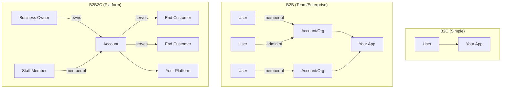

---

## 2. How the Best Rails Apps Model Users

### Comparison Matrix

| Project | Auth | User-Org Link | Roles | Multi-Tenancy | Authorization |
|---------|------|---------------|-------|---------------|---------------|
| **Jumpstart Pro** | Devise + OmniAuth | `AccountUser` join table | Boolean columns on join table | `acts_as_tenant` | Pundit |
| **GitLab** | Devise + OmniAuth + LDAP/SAML | `Member` (polymorphic) | Numeric access levels (0-60) | Namespace hierarchy + `traversal_ids` | DeclarativePolicy |
| **Discourse** | Devise + OmniAuth + SSO | `GroupUser` join table | Trust Levels (0-4) + Groups | Single-instance per community | Guardian (custom) |
| **Chatwoot** | Devise | `AccountUser` join table | `role` enum (agent/admin) + custom roles (JSONB) | `account_id` on all models | Pundit |
| **Mastodon** | Devise + OmniAuth | 1:1 User-Account | `UserRole` with permissions bitmask | Instance-per-deployment | Custom role checks |
| **Forem (dev.to)** | OmniAuth | `OrganizationMembership` | Rolify gem (resource-scoped) | Single-instance | Pundit |
| **Solidus/Spree** | Devise | `RoleUser` join table | CanCanCan permission sets | `solidus_multi_domain` extension | CanCanCan |
| **Clerk.com** | Hosted (email, OAuth, SAML, passkeys) | `OrganizationMembership` | Custom roles + permissions | Organization = tenant | Permission claims in JWT |

### The Universal Pattern

Every serious multi-tenant Rails app converges on the same core schema:

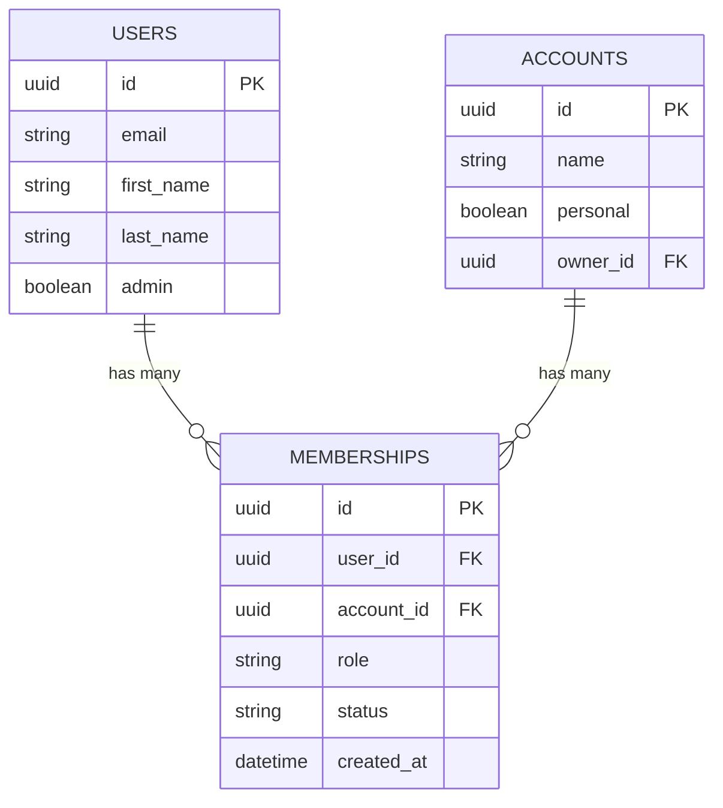

The differences are in _how roles are stored_ and _how permissions are checked_.

---

## 3. Jumpstart Pro Architecture (Our Baseline)

Jumpstart Pro is the closest reference for what we're building. Here's its complete architecture:

### Core Data Model

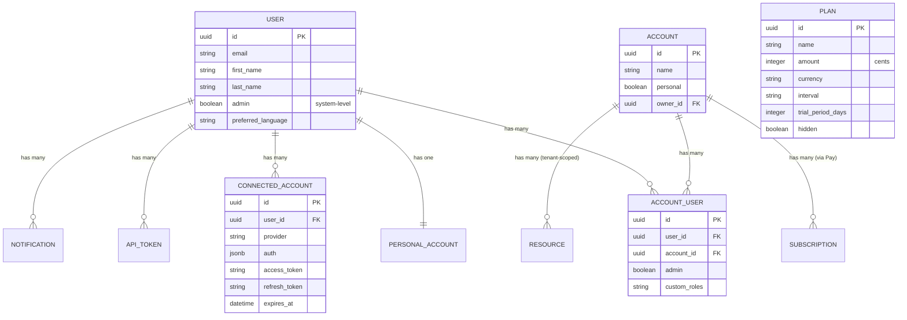

### Two-Tier Authorization

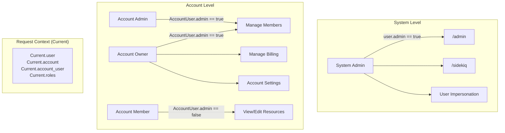

### Key Architectural Decisions

| Decision | Jumpstart Pro's Choice | Why |
|----------|----------------------|-----|
| Primary key | Integer | Simplicity (we use UUID -- better for APIs) |
| Account types | Personal + Team | Personal = single-user, Team = multi-user |
| Role storage | Boolean columns on `AccountUser` | Simple, fast queries |
| Tenant scoping | `acts_as_tenant :account` | Automatic query scoping |
| Request context | `Current` attributes | Thread-safe, per-request |
| Billing target | Account (not User) | Teams share billing |
| API auth | Bearer token per user | `ApiToken` model with last-used tracking |
| OAuth storage | `ConnectedAccount` model | Stores full auth hash + auto-refreshing tokens |

### Authentication Flow

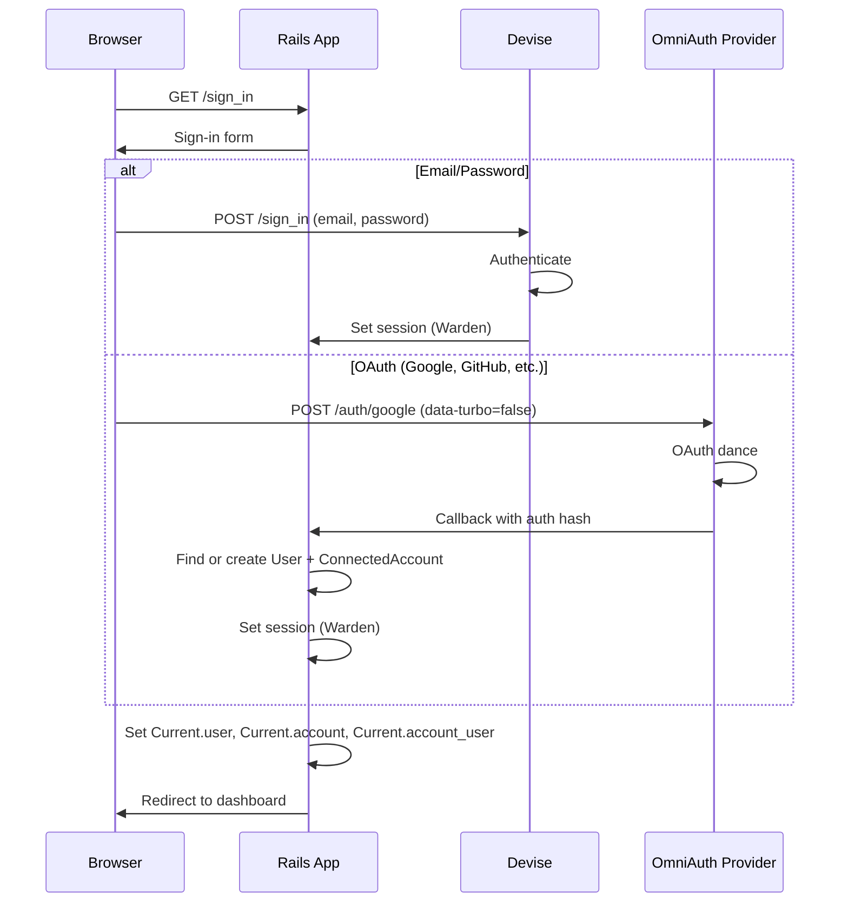

### Account Switching Flow

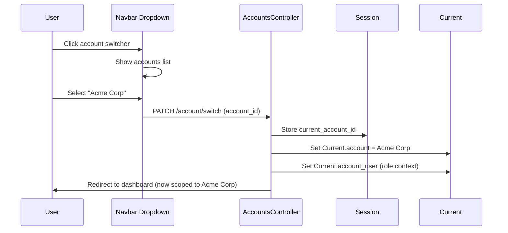

---

## 4. GitLab Architecture (Enterprise-Grade Reference)

GitLab is the gold standard for complex user management in Rails. Key lessons for us:

### Namespace Hierarchy (STI)

GitLab uses a single `namespaces` table with Single Table Inheritance:

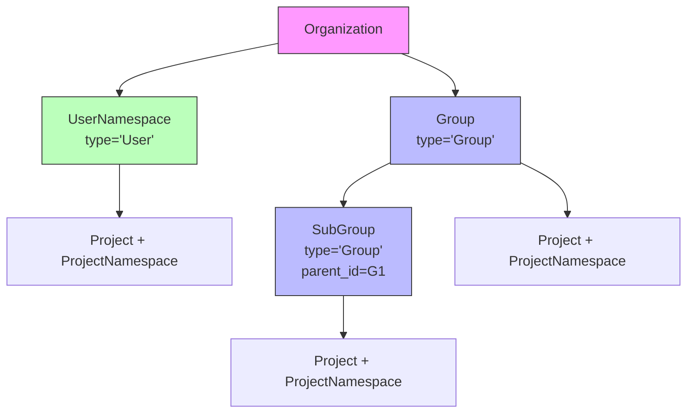

### Traversal IDs (Genius Pattern)

Instead of recursive SQL for hierarchy queries, GitLab stores ancestor chains:

```
Root Group (id=1):        traversal_ids = [1]
  Sub Group (id=2):       traversal_ids = [1, 2]
    Sub-sub Group (id=3): traversal_ids = [1, 2, 3]
```

This enables O(1) ancestor/descendant queries using PostgreSQL array operators. **We should adopt this if we ever need nested accounts/teams.**

### Access Levels

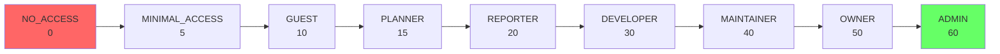

### Permission Cache (project_authorizations)

GitLab materializes permissions into a `project_authorizations` table recalculated by background workers. This avoids expensive JOINs on every request. **Relevant for us if we have deeply nested permissions.**

### DeclarativePolicy DSL

```ruby
# app/policies/project_policy.rb
condition(:public_project) { @subject.public? }
condition(:reporter)       { @user && @subject.team.reporter?(@user) }

rule { public_project }.enable :read_project
rule { reporter }.enable :create_issue
rule { ~reporter }.prevent :create_issue
```

**Our takeaway**: Pundit is simpler and sufficient for our needs. DeclarativePolicy is overkill unless we need GitLab-scale complexity.

---

## 5. Other Open-Source Rails Projects

### Discourse: Trust Levels

Discourse has a unique approach — automated trust levels based on user behavior:

| Level | Name | How Earned | Capabilities |
|-------|------|------------|--------------|
| 0 | New | Default | Read, limited replies |
| 1 | Basic | Read topics, spend time | Reply, flag, PM |
| 2 | Member | Active participation | Invite, wiki, categories |
| 3 | Regular | Consistent contribution | Recategorize, rename, close |
| 4 | Leader | Manually granted | Edit/delete others' posts |

**Our takeaway**: Trust levels are great for community platforms but not applicable to B2B/B2B2C SaaS. Skip.

### Chatwoot: Closest to Our Pattern

Chatwoot is a B2B SaaS built with Rails, and its architecture is nearly identical to Jumpstart Pro:

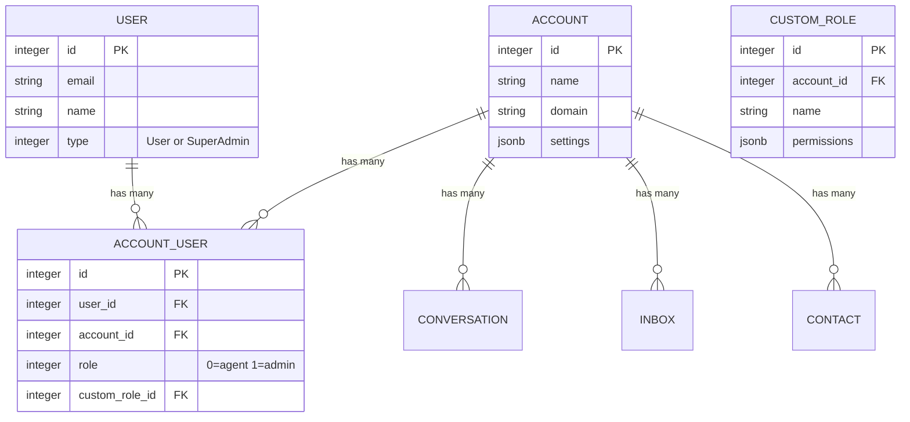

**Key lessons from Chatwoot**:
- Uses Pundit (same as us) with `account_id` scoping
- API controllers namespaced under `Api::V1::Accounts`
- Custom roles stored as JSONB permissions (enterprise feature)
- `Contact` model is separate from `User` — analogous to our B2B2C `Customer`

### Mastodon: Dual-Model Pattern

Mastodon separates **identity** (Account) from **authentication** (User):

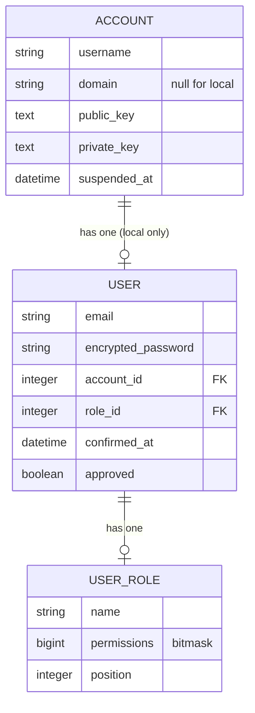

**Our takeaway**: The Account/User split is interesting for federation but unnecessary for SaaS. However, the bitmask permissions pattern on `UserRole` is worth noting as an alternative to boolean columns.

### Forem (dev.to): Rolify

Forem uses the **Rolify** gem for flexible role management:

```ruby
# Roles can be scoped to resources
user.has_role?(:admin)                    # global role
user.has_role?(:moderator, Tag.find(1))   # resource-scoped role
```

**Our takeaway**: Rolify adds flexibility (resource-scoped roles) but introduces a separate `roles` table with polymorphic associations. For most SaaS, boolean columns on the membership join table are simpler.

### Solidus/Spree: CanCanCan + Permission Sets

```ruby
# Permission sets encapsulate groups of permissions
class StockManagement < Spree::PermissionSets::Base
  def activate!
    can :manage, Spree::StockItem
    can :manage, Spree::StockLocation
  end
end

# Role configuration maps roles to permission sets
Spree::RoleConfiguration.configure do |config|
  config.assign_permissions :stock_manager, [StockManagement]
end
```

**Our takeaway**: Permission sets are a clean pattern for grouping related permissions. We could adopt this if we need more granular access control than Pundit policies provide.

---

## 6. Clerk.com Feature Audit

Clerk is the modern standard for what a complete user management system looks like. Here's every feature classified by priority:

### Feature Priority Matrix

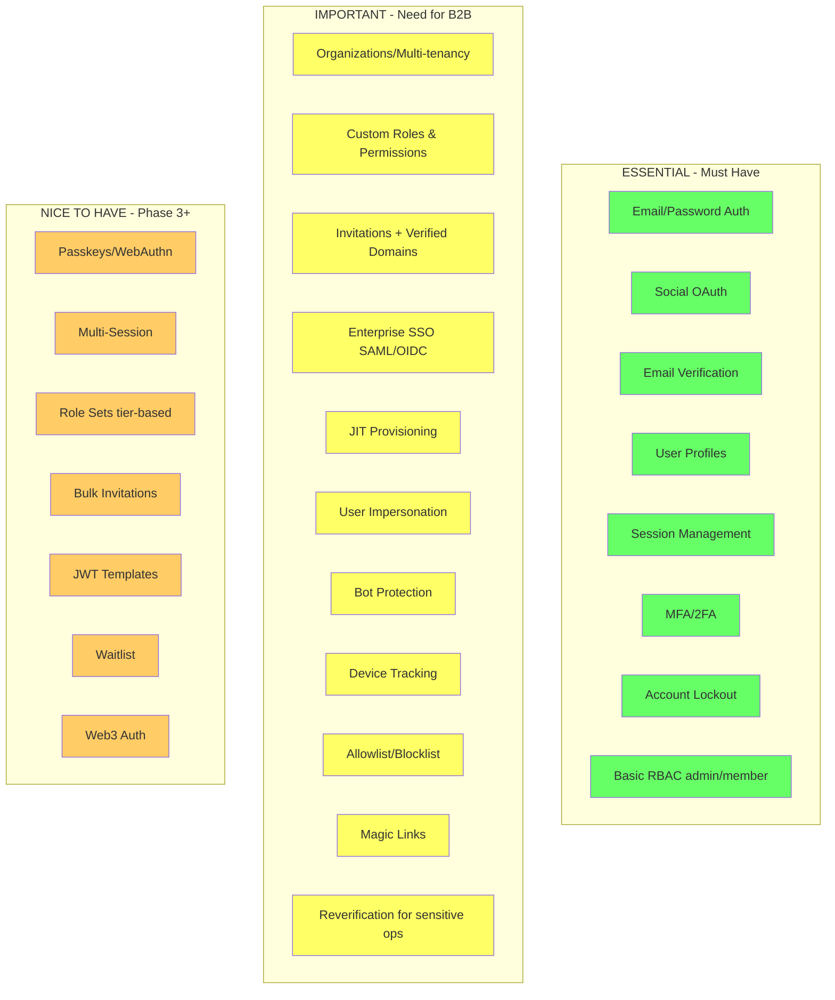

### Clerk's Organization Model (What We Should Replicate)

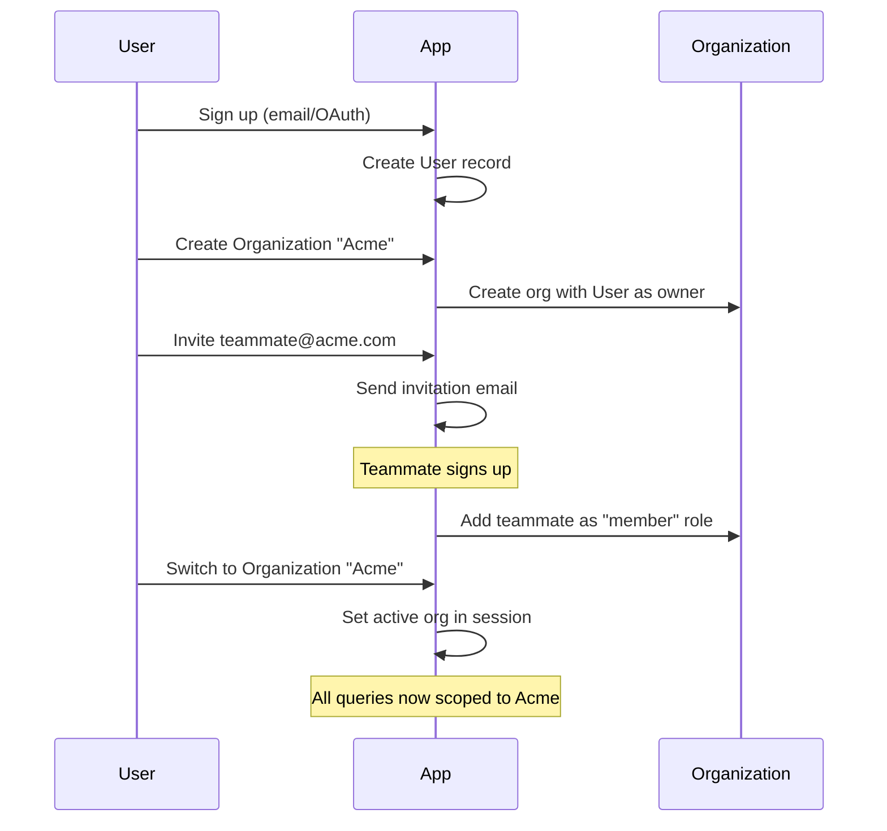

### Clerk's Three Metadata Types (Smart Pattern)

| Type | Frontend Read | Frontend Write | Backend Read | Backend Write | Use Case |
|------|:---:|:---:|:---:|:---:|---------|
| **Public** | Yes | No | Yes | Yes | Subscription tier, feature flags |
| **Private** | No | No | Yes | Yes | Stripe customer ID, internal notes |
| **Unsafe** | Yes | Yes | Yes | Yes | Onboarding data (set during sign-up) |

**Our takeaway**: We can implement this with JSONB columns on our User/Account models:
- `public_metadata` (exposed to frontend)
- `private_metadata` (backend only)

### Should We Build "All of Clerk"?

**Short answer: Yes, but in phases.**

Clerk provides ~25 features. Building them all from scratch would take months. But we're building a **starter kit**, so we need the infrastructure for all of them even if not all are implemented on day one.

**What we build ourselves** (Rails is great at this):
- Authentication (Devise + OmniAuth)
- Organizations/Accounts
- Memberships with roles
- Invitations
- Session management
- RBAC with Pundit
- User impersonation
- Webhooks

**What we integrate** (not worth building from scratch):
- SAML/OIDC Enterprise SSO → `omniauth-saml` gem
- MFA/2FA → `devise-two-factor` gem
- Bot protection → Cloudflare or reCAPTCHA

**What we skip** (Clerk-specific or low-value):
- Multi-session (unnecessary complexity)
- Web3 auth (niche)
- Pre-built UI components (we have our own views)

---

## 7. B2B2C Patterns (Kajabi, Shopify)

### How B2B2C Platforms Separate Users

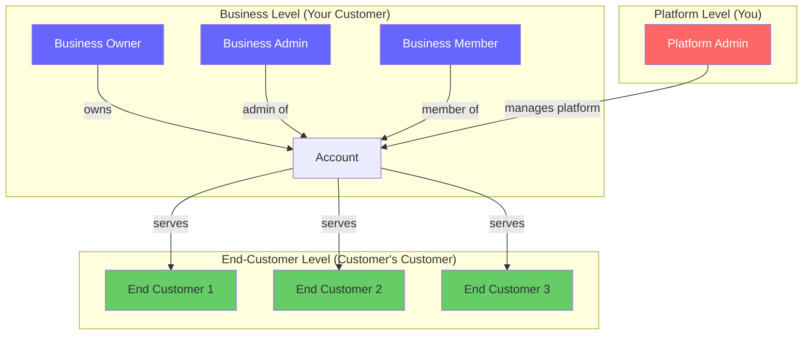

### Kajabi's Model

| User Type | Auth Surface | What They See |
|-----------|-------------|---------------|
| **Account Owner** | `app.kajabi.com/admin` | Full admin dashboard |
| **Account Admin** | `app.kajabi.com/admin` | Admin (except payment settings) |
| **Member** (end customer) | `yoursite.mykajabi.com` | Purchased courses/products |
| **Subscriber** (lead) | N/A | Marketing emails only, no login |

**Billing is two-level:**
1. Business pays Kajabi (Stripe subscription)
2. Business charges their customers (Stripe Connect)

### Shopify's Architecture

Shopify uses **completely separate auth systems**:

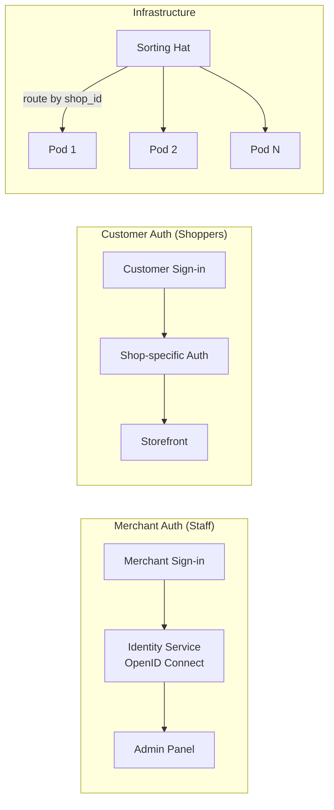

### The Two-Table Pattern for B2B2C

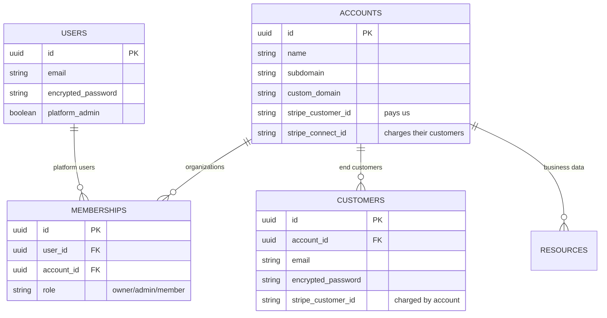

**Key insight**: `User` and `Customer` are **separate Devise scopes** with separate:
- Login URLs (`/admin/sign_in` vs `yoursite.example.com/sign_in`)
- Session cookies
- Password policies
- Authentication flows

---

## 8. Multi-Tenancy Strategies

### Strategy Comparison

```mermaid
graph TD
    subgraph "A: Row-Level Scoping (acts_as_tenant)"
        A1[Single DB] --> A2[account_id on every table]
        A2 --> A3[WHERE account_id = ?]
    end

    subgraph "B: Schema-Per-Tenant (Apartment)"
        B1[Single DB] --> B2[PostgreSQL schema per tenant]
        B2 --> B3[SET search_path = tenant_schema]
    end

    subgraph "C: Database-Per-Tenant"
        C1[DB per tenant] --> C2[Full isolation]
        C2 --> C3[establish_connection per request]
    end

    subgraph "D: PostgreSQL RLS"
        D1[Single DB] --> D2[Row Level Security policies]
        D2 --> D3["SET app.current_tenant = uuid"]
    end
```

### Decision Matrix

| Factor | Row-Level (acts_as_tenant) | Schema-Per-Tenant | DB-Per-Tenant | PostgreSQL RLS |
|--------|:---:|:---:|:---:|:---:|
| Setup complexity | **Low** | Medium | High | Medium |
| Data leak risk | Medium (app-level) | Low | **Minimal** | **Low (DB-level)** |
| Migration speed | **O(1)** | O(n) | O(n) | **O(1)** |
| Operational overhead | **None** | Growing | Significant | **Low** |
| Max tenant count | **Unlimited** | ~Hundreds | ~Hundreds | **Unlimited** |
| Rails compatibility | **Excellent** | Occasional conflicts | Variable | Good |
| B2B2C suitability | **Best** | Possible | Overkill | **Strong alt** |
| Gem maturity | **Excellent** | Declining | N/A | Growing |

### Our Choice: acts_as_tenant + Optional RLS

**Primary**: `acts_as_tenant` for application-level scoping
- Works with our existing Devise + Pundit + Grape stack
- O(1) migrations
- Unlimited tenants
- Well-maintained gem

**Optional enhancement**: PostgreSQL RLS for defense-in-depth
- Database-level enforcement as a safety net
- Cannot be bypassed by application bugs
- Add later when security requirements demand it

---

## 9. Proposed Architecture for Our Starter

### Complete Data Model

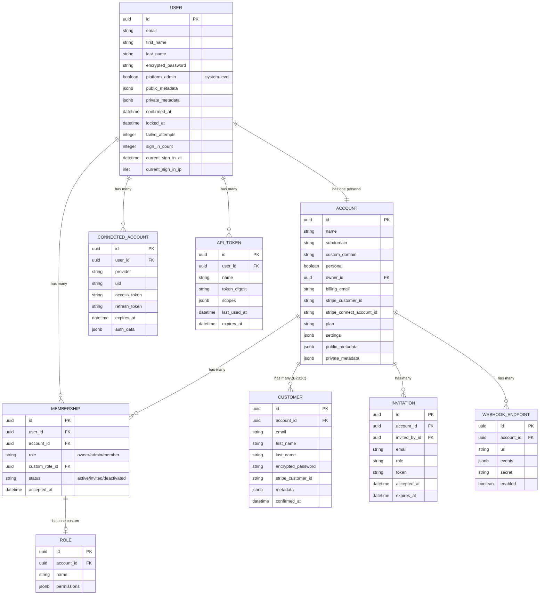

### Request Lifecycle

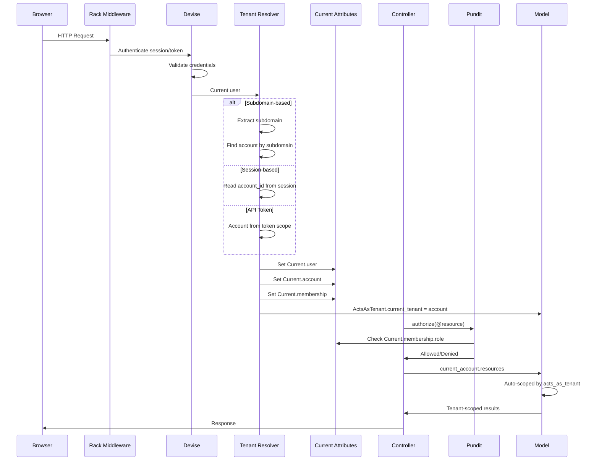

### Authorization Architecture

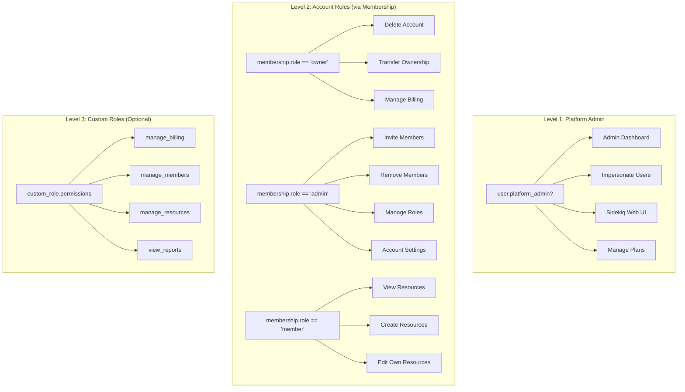

### Tenant Resolution Strategies

```mermaid
graph LR
    subgraph "How We Find the Current Account"
        S1[Subdomain<br/>acme.app.com] --> Resolver
        S2[Custom Domain<br/>acme.com] --> Resolver
        S3[Session<br/>session[:account_id]] --> Resolver
        S4[Path<br/>/accounts/:id/...] --> Resolver
        S5[API Header<br/>X-Account-ID] --> Resolver

        Resolver[Tenant Resolver] --> CA[Current.account]
    end
```

### B2B2C: Two Auth Surfaces

```mermaid
graph TB
    subgraph "Platform Users (Devise scope: :user)"
        Login1["/users/sign_in"] --> Admin["Admin Dashboard<br/>Manage account, team, billing"]
    end

    subgraph "End Customers (Devise scope: :customer)"
        Login2["tenant.app.com/sign_in"] --> Storefront["Customer-Facing App<br/>Consume products/services"]
    end

    subgraph "Shared Infrastructure"
        DB[(PostgreSQL)]
        Redis[(Redis)]
        Sidekiq[Sidekiq Workers]
    end

    Admin --> DB
    Storefront --> DB
```

---

## 10. Implementation Phases

### Phase 1: Foundation (B2C + Basic B2B)

```
Priority: ESSENTIAL
Supports: B2C, basic B2B

Models to build:
  - Account (personal + team)
  - Membership (user <-> account with role)
  - Current attributes (user, account, membership)

Features:
  [x] Devise authentication (already have)
  [ ] Account model with personal/team types
  [ ] Membership model with owner/admin/member roles
  [ ] Current.account, Current.membership
  [ ] acts_as_tenant integration
  [ ] Account switching UI
  [ ] Personal account auto-creation on signup
  [ ] Account settings page
  [ ] Pundit policies checking membership roles
```

### Phase 2: Team Management

```
Priority: IMPORTANT
Supports: B2B team collaboration

Models to build:
  - Invitation
  - ConnectedAccount (OAuth)

Features:
  [ ] Email invitations with token-based acceptance
  [ ] OmniAuth social login (Google, GitHub)
  [ ] Connected accounts management
  [ ] Member management UI (invite, remove, change role)
  [ ] Account-scoped API tokens
  [ ] User impersonation for platform admins
```

### Phase 3: Enterprise B2B

```
Priority: IMPORTANT for enterprise
Supports: Enterprise B2B customers

Models to build:
  - Role (custom roles with JSONB permissions)

Features:
  [ ] Custom roles with granular permissions
  [ ] SAML SSO (omniauth-saml)
  [ ] Domain verification for accounts
  [ ] JIT provisioning (auto-add users from verified domains)
  [ ] MFA/2FA (devise-two-factor)
  [ ] Audit log (extend Paper Trail per-account)
  [ ] Webhook endpoints for account events
```

### Phase 4: B2B2C Platform

```
Priority: IMPORTANT for B2B2C
Supports: Kajabi/Shopify-style platforms

Models to build:
  - Customer (separate Devise scope)
  - CustomerSession

Features:
  [ ] Customer model with separate auth
  [ ] Subdomain-based tenant resolution
  [ ] Custom domain support (CNAME)
  [ ] Customer-facing sign-up/sign-in
  [ ] Stripe Connect for account-level payments
  [ ] Customer-facing views/layouts
```

### Phase 5: Polish & Advanced

```
Priority: NICE-TO-HAVE
Supports: Mature SaaS

Features:
  [ ] Passkeys/WebAuthn
  [ ] Magic link authentication
  [ ] Bot protection (CAPTCHA integration)
  [ ] Device tracking and session management UI
  [ ] Allowlist/blocklist for sign-ups
  [ ] Bulk invitations
  [ ] Account transfer
  [ ] Data export per account
```

### Implementation Timeline Visualization

```mermaid
gantt
    title SaaS User Management Implementation Phases
    dateFormat  YYYY-MM-DD
    axisFormat  %b

    section Phase 1 - Foundation
    Account model & membership      :p1a, 2026-03-15, 3d
    Current attributes & tenant     :p1b, after p1a, 2d
    Account switching & UI          :p1c, after p1b, 2d
    Pundit policies                 :p1d, after p1c, 2d

    section Phase 2 - Teams
    Invitations system              :p2a, after p1d, 3d
    OAuth social login              :p2b, after p2a, 2d
    Member management UI            :p2c, after p2b, 2d
    API tokens                      :p2d, after p2c, 2d
    User impersonation              :p2e, after p2d, 1d

    section Phase 3 - Enterprise
    Custom roles & permissions      :p3a, after p2e, 3d
    SAML SSO                        :p3b, after p3a, 3d
    MFA/2FA                         :p3c, after p3b, 2d
    Domain verification & JIT       :p3d, after p3c, 2d
    Webhooks                        :p3e, after p3d, 2d

    section Phase 4 - B2B2C
    Customer model & auth           :p4a, after p3e, 3d
    Subdomain & custom domains      :p4b, after p4a, 3d
    Stripe Connect                  :p4c, after p4b, 3d
    Customer-facing views           :p4d, after p4c, 3d
```

---

## 11. Stack Decisions

These architectural choices were evaluated against GitLab, Jumpstart Pro, Chatwoot, Clerk, and community best practices.

| Decision | Choice | Rationale |
|----------|--------|-----------|
| **Authentication** | Devise + OmniAuth | Already configured, battle-tested, supports social + SAML |
| **Authorization** | Pundit | Already configured, simple policies, Chatwoot uses it at scale |
| **UI Components** | Phlex (components) + ERB partials (layouts) | 5-10x faster than partials, single-file Ruby components, growing Rails ecosystem |
| **Role Storage** | String enum on membership join table | Flexible, extensible — avoids Jumpstart Pro's boolean-column limitation |
| **Multi-tenancy** | acts_as_tenant | O(1) migrations, unlimited tenants, works with existing stack |
| **Notifications** | Noticed gem | Multi-channel (DB, email, Slack, ActionCable), used by Jumpstart Pro |
| **Billing** | Pay gem + Stripe Connect (B2B2C) | Handles subscriptions on Account, not User. Stripe Connect for two-level billing |
| **Background Jobs** | Sidekiq | Already configured, mature, great monitoring UI |
| **API Auth** | Bearer tokens (DB-stored) | Revocable, auditable — avoids JWT statefulness trap |
| **Request Context** | Rails Current attributes | Thread-safe, per-request — `Current.user`, `Current.account`, `Current.membership` |
| **Audit Trail** | Paper Trail | Already configured |
| **Search** | PostgreSQL full-text (pg_search) | No external dependencies, add when needed |

### Why NOT GitLab Style

| GitLab Pattern | Why They Need It | Why We Don't |
|---|---|---|
| Namespace STI | 20-level nested group hierarchies | Flat account structure |
| DeclarativePolicy DSL | Hundreds of permission rules | Pundit with ~10 policies |
| traversal_ids array | O(1) ancestor queries on deep trees | No nesting needed |
| project_authorizations cache | Millions of permission checks/sec | Not our scale |
| Numeric access levels (0-60) | Comparing ranks in inherited hierarchies | Simple string enum suffices |

**Worth borrowing later if needed**: traversal_ids for nested teams, custom roles extending base roles.

### Why Phlex over ViewComponent

| | Partials | ViewComponent | Phlex |
|---|---|---|---|
| Performance | Slowest | ~2x faster | ~5-10x faster |
| Testing | Awkward | Unit testable | Unit testable |
| Boilerplate | Low | High (class + template) | Low (single Ruby file) |
| Hotwire compat | Yes | Yes | Yes |
| Momentum | Standard | Plateauing | Growing fast |

---

## 12. Sources

### Jumpstart Pro
- [Authentication Docs](https://jumpstartrails.com/docs/authentication)
- [Accounts Docs](https://jumpstartrails.com/docs/accounts)
- [Roles Docs](https://jumpstartrails.com/docs/roles)
- [Multitenancy Docs](https://jumpstartrails.com/docs/multitenancy)
- [Notifications Docs](https://jumpstartrails.com/docs/notifications)
- [Subscriptions Docs](https://jumpstartrails.com/docs/subscriptions)

### GitLab
- [OmniAuth Integration](https://docs.gitlab.com/integration/omniauth/)
- [Namespaces Development](https://docs.gitlab.com/development/namespaces/)
- [Organization Development](https://docs.gitlab.com/development/organization/)
- [Roles and Permissions](https://docs.gitlab.com/user/permissions/)
- [Predefined Roles](https://docs.gitlab.com/development/permissions/predefined_roles/)
- [DeclarativePolicy Framework](https://docs.gitlab.com/development/policies/)
- [Authorization Guidelines](https://docs.gitlab.com/development/permissions/authorizations/)
- [Custom Roles](https://docs.gitlab.com/user/custom_roles/)
- [Sharding Guidelines](https://docs.gitlab.com/development/organization/sharding/)
- [GitLab Cells](https://docs.gitlab.com/development/cells/)
- [GitLab Postgres Schema Design Notes](https://shekhargulati.com/2022/07/08/my-notes-on-gitlabs-postgres-schema-design/)

### Open-Source Rails Projects
- [Mastodon Account & User Management](https://deepwiki.com/mastodon/mastodon/3.3-account-and-user-management)
- [Mastodon Architecture](https://softwaremill.com/the-architecture-of-mastodon/)
- [Chatwoot Core Data Models](https://deepwiki.com/chatwoot/chatwoot/3-core-data-models)
- [Chatwoot Custom Roles](https://github.com/chatwoot/chatwoot/issues/4216)
- [Forem Backend Roles](https://developers.forem.com/backend/roles)
- [Forem Architecture](https://developers.forem.com/technical-overview/architecture)
- [Solidus Permission Management](https://guides.solidus.io/advanced-solidus/permission-management/)
- [Spree Multi-Tenant Quickstart](https://spreecommerce.org/docs/developer/multi-tenant/quickstart)

### Clerk.com
- [Clerk Documentation](https://clerk.com/docs)
- [Organizations Overview](https://clerk.com/docs/guides/organizations/overview)
- [Roles and Permissions](https://clerk.com/docs/guides/organizations/control-access/roles-and-permissions)
- [Authentication Strategies](https://clerk.com/docs/guides/configure/auth-strategies/sign-up-sign-in-options)
- [Enterprise SSO](https://clerk.com/docs/guides/configure/auth-strategies/enterprise-connections/overview)
- [Session Tokens](https://clerk.com/docs/guides/sessions/session-tokens)
- [Webhooks](https://clerk.com/docs/guides/development/webhooks/overview)
- [User Metadata](https://clerk.com/docs/guides/users/extending)
- [Ruby on Rails SDK](https://clerk.com/docs/reference/ruby/rails)
- [Bot Protection](https://clerk.com/docs/guides/secure/bot-protection)
- [Verified Domains](https://clerk.com/docs/guides/organizations/add-members/verified-domains)
- [JIT Provisioning](https://clerk.com/docs/authentication/enterprise-connections/jit-provisioning)

### B2B2C & Multi-Tenancy
- [Kajabi Account Users](https://help.kajabi.com/en/articles/12696243-account-users)
- [Kajabi Members vs Subscribers](https://help.kajabi.com/hc/en-us/articles/360036982534-Difference-between-Members-and-Subscribers)
- [Stripe - Kajabi Payments](https://stripe.com/customers/kajabi)
- [Shopify Pods Architecture](https://shopify.engineering/a-pods-architecture-to-allow-shopify-to-scale)
- [Shopify Central Authentication](https://shopify.engineering/implement-secure-central-authentication-service-six-steps)
- [Shopify + Auth0](https://auth0.com/blog/shopify-auth0-a-new-era-for-retail-customer-identity/)
- [WorkOS - User Management for B2B SaaS](https://workos.com/blog/user-management-for-b2b-saas)
- [Arkency - Multitenancy Approaches](https://blog.arkency.com/comparison-of-approaches-to-multitenancy-in-rails-apps/)
- [Arkency - Multitenancy Experiences](https://blog.arkency.com/peoples-experiences-with-approaches-to-multitenancy/)
- [Crunchy Data - acts_as_tenant](https://www.crunchydata.com/blog/using-acts_as_tenant-for-multi-tenant-postgres-with-rails)
- [Crunchy Data - Row Level Security](https://www.crunchydata.com/blog/row-level-security-for-tenants-in-postgres)
- [GitHub - acts_as_tenant](https://github.com/ErwinM/acts_as_tenant)
- [GitHub - ros-apartment](https://github.com/rails-on-services/apartment)
- [GitHub - rls_multi_tenant](https://github.com/codingways/rls_multi_tenant)
- [LoginRadius - RBAC for SaaS](https://www.loginradius.com/blog/engineering/rbac-saas-multi-tenant-b2b-platforms/)
